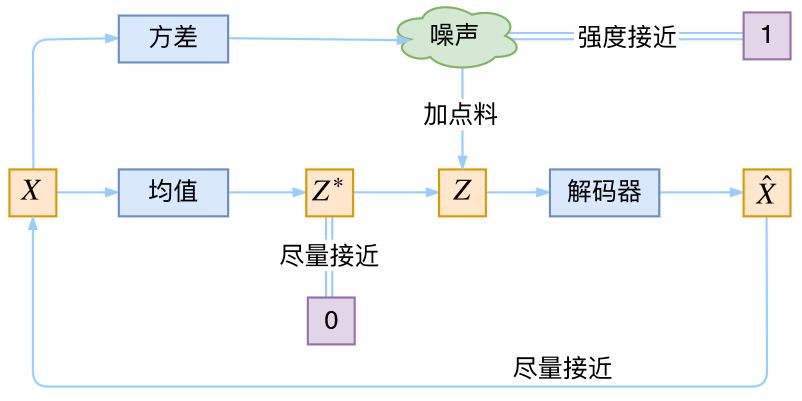

<!--
 * @version:
 * @Author:  StevenJokess https://github.com/StevenJokess
 * @Date: 2020-09-24 22:02:12
 * @LastEditors:  StevenJokess https://github.com/StevenJokess
 * @LastEditTime: 2020-12-27 15:12:46
 * @Description:
 * @TODO::
 * @Reference:
-->


# Variational Autoencoders (VAEs)

- VAE的核心是变分推理（VI）。与执行变分推理的现有统计方法相比，DNN只是分辨率非常高的一种方法。
- 与GAN（通用对抗网络）相比，由于它们具有使用给定信息创建新内容的能力，因此通常都是无监督学习。
- 如果GAN基于两人游戏概念提出新的Loss函数，则可以将VAE视为在自动编码器概念下重新解释VAE的目标函数，而不是提供新的Loss Function。

- 它的特点是使用DNN的大容量VI定义隐藏变量。
- 与可以被认为是变分推理的前身（？）的EM算法相比，变分推理不是基于概率模型，而是仅用于近似分布，而VAE是使这一思想最大化的一种方法。
- VAE的工具分布完全不基于概率模型，样本仅需为方便的概率分布。

- 通过使用DNN，使用SGD优化算法很容易学习。
- 在使用VI估计分布的情况下，以前使用了需要大量计算的技术，例如MCMC，但是VAE的优势在于能够轻松应用基于反向传播的方法。[18]

Representation 建模

假设了真实分布有隐变量 $Z$ 的影响，我们有 $p_{data}(x),$ 那每个样本的生成过程如下：
$$
\begin{aligned}
P_{\theta}(X, Z) &=P(Z) P(X \mid Z) \\
z & \sim P(Z) \\
x & \sim P(X \mid Z)
\end{aligned}
$$

## Objective Function

$$
\begin{array}{l}
\min _{\theta} K L\left(p_{\text {data }}(x) \| p_{\theta}(x)\right) \\
=\max _{\theta} E_{x \sim p_{\text {data }}\left[\log p_{\theta}(x)\right]} \\
=\max _{\theta} E_{x \sim p_{\text {data }}\left[\log \int p_{\theta}(x, z) d z\right]} \\
=\max _{\theta} E_{x \sim p_{\text {data }}\left[\log \int \frac{q_{\lambda}(z)}{q_{\lambda}(z)} p_{\theta}(x, z) d z\right]} \\
\geq \max _{\theta} E_{x \sim p_{\text {data }}\left[E_{q_{\lambda}(z)} \log \frac{p_{\theta}(x, z)}{q_{\lambda}(z)}\right]} \\
\approx \max _{\theta} \frac{1}{|D|} \sum_{x \in D}\left[E_{q_{\lambda}(z)} \log \frac{p_{\theta}(x, z)}{q_{\lambda}(z)}\right] \\
=\max _{\theta} \sum_{x \in D} \max _{\lambda} E_{q_{\lambda}(z)} \log \frac{p_{\theta}(x, z)}{q_{\lambda}(z)} \\
=\max _{\theta} \sum_{x \in D} \max _{\lambda} E L B O(x ; \theta, \lambda)
\end{array}
$$
## Optimization Procedure[16]

Variational Inference的方式进行参数更新:
$$
\begin{aligned}
\lambda^{(i)} & \leftarrow \lambda^{(i)}+\alpha \nabla_{\lambda} E L B O(x ; \theta, \lambda) \\
\theta^{(i)} & \leftarrow \theta^{(i)}+\alpha \nabla_{\theta} E L B O(x ; \theta, \lambda)
\end{aligned}
$$

解释一下：
- (1) 固定 $\theta$, 更新 $\lambda,$ 以一种approximate的方式去计算$\operatorname{logp } _ { \theta } ( x )$
- (2)根据(1), 得到mini-batch中的logp $_{\theta}(x)$ 后，去更新模型参数 $\theta,$ 将 $p_{\theta}$ 拉近 $p_{\text {data }}$
其中涉及的Gradient Estimation, 使用到的REINFORCE和reparameteriazation的trick, 以及最后的 Amortized Inference的详情参见[17]

## Expectation-Maximization (EM)

A straightforward way to approach VAE is through the construction of the well-known Expectation-Maximization (EM) algorithm. Please refer to this tutorial or this blog as a refresher on EM. Just to quicly recap a few key elements in EM: insteand of optimizing the log-liklihood ($\ell(\theta)$) directly with observable data $x$, latent variable $z$, EM constructs and optimize on a lower bound $\mathcal{L}(q,\theta)$ often referred to as Evidence Lower Bond (EBLO). The following equation derives from Jensen's inequality and holds for any $q(z)$ as long as it is a valid probability distribution.


$$\ell(\theta^{t-1}) \underset{E-step}{=} \mathcal L(q^t,\theta^{t-1}) \underset{M-step}{\le} \mathcal L(q^t,\theta^t) \underset{Jensen}{\le} \ell(\theta^{t})$$

## From EM to VAE

With more complex distributions of $p_\theta(x\vert z)$, the integration in E-step for exact inference of the posterier $p_\theta(z\vert x)$ is intractable. This posterier inference problem can be addressed with variational inference methods such as mean-field approximation (where we assume factorizable $q(z)$) or sampling based methods (e.g. collapsed Gibbs sampling for solving Latent Dirichlet allocation). Mean-field approximation put undue constraints on the variational family $q(z)$, and sampling based methods could have slow convergence problems. Moreover, both methods involves arduous derivation of update functions, that would require rederivation even for small changes in model and thus could limit the exploration of more complex models.

Auto-Encoding Variational Bayes brought about a flexible neural-network based approach. In this framework, the variational inference / variational optimization task of finding the optimal $q$ become a matter of finding the best parameters of a neural network via backpropagation and stochastic gradient descent. Thus making blackbox inference possible as well as allowing scalable trainng for deeper and larger neural network models. We refer to this framework as Neural Variational Inference.


VAE，也可以叫做变分自编码器，属于自动编码器的变体。

VAE是对自动编码器的概率处理，它是一种将高维输入数据压缩成更小表示的模型。传统的自动编码器将输入映射到潜在的向量上，VAE不同于此，它将输入数据映射到概率分布的参数上，例如高斯分布的均值和方差。这种方法产生了一个连续的、结构化的潜在空间，对图像的生成非常有用。[6]

对于变分自编码器我们将定义一个不易处理的密度函数，通过附加的隐变量$z$对密度函数进行建模。[15] VAE原理图如下[6]：

相比普通的自编码器，VAE的改动就是：[16]

1、引入了均值和方差的概念，加入了重参数操作；

2、加入了KL散度为额外的损失函数。


KL散度的作用，要让隐变量的分布对齐（多元的）标准正态分布，而不是任意正态分布。

在VAE中（包括后来的对抗自编码器），直接通过KL散度让隐变量的分布对齐一个解耦的先验分布，这样带来的好处便是隐变量本身也接近解耦的，从而拥有前面说的解耦的各种好处。因此，现在我们可以回答一个很可能会被问到的问题：

> 问：从特征编码的角度看，变分自编码器相比普通的自编码器有什么好处？

> 答：变分自编码器通过KL散度让隐变量分布靠近标准正态分布，从而能解耦隐变量特征，简化后面的建立在该特征之上的模型。（当然，你也可以联系前面说的变分信息瓶颈来回答一波，比如增强泛化性能等^_^）

VAE通过约束隐变量$z$服从标准正太分布以及重构数据实现了分布转换映射$X=G(z)$[15]
VAE通过隐变量$z$与标准正太分布的KL散度和重构误差去度量。[15]

假设一个生成模型（如图13.3所示）中包含隐变量，即有部分变量是不可观测的，其中观测变量𝑿是一个高维空间𝒳中的随机向量，隐变量𝒁是一个相对低维的空间𝒵中的随机向量．

自动编码器是一种人工神经网络，用于学习高效的数据值编码以无监督方式。自动编码器的目的是通过训练网络忽略信号“噪声” 来学习一组数据的表示（编码），通常用于降维。基本模型存在几种变体，其目的是强制学习的输入表示形式具有有用的属性。

与经典（稀疏，去噪等）自动编码器不同，变分自动编码器（VAE）是生成模型，例如生成对抗网络。文章重点解决，在存在具有难解的后验分布的连续潜在变量和大型数据集的情况下，如何在定向概率模型中进行有效的推理和学习。他们引入了一种随机变分推理和学习算法，该算法可以扩展到大型数据集，并且在某些微分可微性条件下甚至可以在难处理的情况下工作。

作者证明了变化下界的重新参数化产生了一个下界估计量，该估计量可以使用标准随机梯度方法直接进行优化。 其次表明，对于每个数据点具有连续潜在变量的iid数据集，通过使用拟议的下界估计器将近似推理模型（也称为识别模型）拟合到难处理的后验，可以使后验推理特别有效。

主要提出者Durk Kingma（Diederik P. Kingma），目前就职于Google。 在加入Google之前，于2017年获得阿姆斯特丹大学博士学位，并于2015年成为OpenAI创始团队的一员。 他主要研究的方向为：推理，随机优化，可识别性。其中的研究成就包括变分自编码器（VAE）（一种用于生成建模的有原则的框架）以及广泛使用的随机优化方法Adam。[9]

简单来说, VAE的优化目标是：

$$
K L(\tilde{p}(x) p(z \mid x) \| q(z) q(x \mid z))=\iint \tilde{p}(x) p(z \mid x) \log \frac{\tilde{p}(x) p(z \mid x)}{q(x \mid z) q(z)} d z d x
$$

其中 $q(z)$ 是标准正态分布, $p(z \mid x), q(x \mid z)$ 是条件正态分布，分别对应编码器、解码器。具体细节可以参考 [《变分自编码器(二) : 从贝叶斯观点出发》](https://kexue.fm/archives/5343)。
这个目标最终可以简化为

$$
\mathbb{E}_{x \sim \tilde{p}(x)}\left[\mathbb{E}_{z \sim p(z \mid x)}[-\log q(x \mid z)]+K L(p(z \mid x) \| q(z))\right]
$$

显然, 它可以分开来看: $\mathbb{E}_{z \sim p(z \mid x)}[-\log q(x \mid z)]$ 这一项相当于普通的自编码器损失（加上了重参数）， $K L(p(z \mid x) \| q(z))$ 是 后验分布与先验分布的KL散度。第一项是希望重构损失越小越好，也就是希望中间的隐变量z能尽可能保留更多的信息，第二项是要隐变量空间跟正态分布对齐, 意思是希望隐变量的分布更加规整一些。

In a nutshell, a VAE is an autoencoder whose encodings distribution is regularised during the training in order to ensure that its latent space has good properties allowing us to generate some new data. Moreover, the term “variational” comes from the close relation there is between the regularisation and the variational inference method in statistics.

autoencoders are neural networks architectures composed of both an encoder and a decoder that create a bottleneck to go through for data and that are trained to lose a minimal quantity of information during the encoding-decoding process (training by gradient descent iterations with the goal to reduce the reconstruction error)[4]

Auto-Encoding Variational Bayes by Diederik P Kingma and Max Welling, presented at ICLR 2014 (https://arxiv.org/abs/1312.6114).

```python
#[5]
class VAE(keras.Model):
    def __init__(self, encoder, decoder, **kwargs):
        super(VAE, self).__init__(**kwargs)
        self.encoder = encoder
        self.decoder = decoder

    def train_step(self, data):
        if isinstance(data, tuple):
            data = data[0]
        with tf.GradientTape() as tape:
            z_mean, z_log_var, z = encoder(data)
            reconstruction = decoder(z)
            reconstruction_loss = tf.reduce_mean(
                keras.losses.binary_crossentropy(data, reconstruction)
            )
            reconstruction_loss *= 28 * 28
            kl_loss = 1 + z_log_var - tf.square(z_mean) - tf.exp(z_log_var)
            kl_loss = tf.reduce_mean(kl_loss)
            kl_loss *= -0.5
            total_loss = reconstruction_loss + kl_loss
        grads = tape.gradient(total_loss, self.trainable_weights)
        self.optimizer.apply_gradients(zip(grads, self.trainable_weights))
        return {
            "loss": total_loss,
            "reconstruction_loss": reconstruction_loss,
            "kl_loss": kl_loss,
        }
```

```py
# VAE model
# [14]
class VAE(nn.Module):
    def __init__(self, image_size=784, h_dim=400, z_dim=20):
        super(VAE, self).__init__()
        self.fc1 = nn.Linear(image_size, h_dim)
        self.fc2 = nn.Linear(h_dim, z_dim)
        self.fc3 = nn.Linear(h_dim, z_dim)
        self.fc4 = nn.Linear(z_dim, h_dim)
        self.fc5 = nn.Linear(h_dim, image_size)

    def encode(self, x):
        h = F.relu(self.fc1(x))
        return self.fc2(h), self.fc3(h)

    def reparameterize(self, mu, log_var):
        std = torch.exp(log_var/2)
        eps = torch.randn_like(std)
        return mu + eps * std

    def decode(self, z):
        h = F.relu(self.fc4(z))
        return F.sigmoid(self.fc5(h))

    def forward(self, x):
        mu, log_var = self.encode(x)
        z = self.reparameterize(mu, log_var)
        x_reconst = self.decode(z)
        return x_reconst, mu, log_var
```

A collection of Variational AutoEncoders (VAEs) implemented in pytorch with focus on reproducibility. [3]

variational autoencoders (VAEs) are autoencoders that tackle the problem of the latent space irregularity by making the encoder return a distribution over the latent space instead of a single point and by adding in the loss function a regularisation term over that returned distribution in order to ensure a better organisation of the latent space[4]


[5]

[5]

[5]

变分自编码器（Variational AutoEncoder，VAE）[Kingma et al.,2014]是一种深度生成模型，其思想是利用神经网络来分别建模两个复杂的条件概率密度函数．（1）用神经网络来估计变分分布𝑞(𝒛;𝜙)，称为推断网络．理论上𝑞(𝒛;𝜙)可以不依赖𝒙．但由于𝑞(𝒛;𝜙)的目标是近似后验分布𝑝(𝒛|𝒙;𝜃)，其和𝒙相关，因此变分密度函数一般写为𝑞(𝒛|𝒙;𝜙)．推断网络的输入为𝒙，输出为变分分布𝑞(𝒛|𝒙;𝜙)．（2）用神经网络来估计概率分布𝑝(𝒙|𝒛;𝜃)，称为生成网络．生成网络的输入为𝒛，输出为概率分布𝑝(𝒙|𝒛;𝜃)．将推断网络和生成网络合并就得到了变分自编码器的整个网络结构，如图13.4所示，其中实线表示网络计算操作，虚线表示采样操作．


深度生成模型，比如变分自编码器、深度信念网络等，都是显示地构建出样本的密度函数𝑝(𝒙;𝜃)，并通过最大似然估计来求解参数，称为显式密度模型（Explicit Density Model）．比如，变分自编码器的密度函数为𝑝(𝒙,𝒛;𝜃) = 𝑝(𝒙|𝒛;𝜃)𝑝(𝒛;𝜃)．虽然使用了神经网络来估计𝑝(𝒙|𝒛;𝜃)，但是我们依然假设𝑝(𝒙|𝒛;𝜃)为一个参数分布族，而神经网络只是用来预测这个参数分布族的参数．这在某种程度上限制了神经网络的能力．[6]

变分自编码器是一个非常典型的深度生成模型，利用神经网络的拟合能力来有效地解决含隐变量的概率模型中后验分布难以估计的问题[Kingma et al.,2014;Rezende et al.,2014]．变分自编码器的详尽介绍可以参考文献[Doersch,2016]．[Bowman et al.,2016]进一步将变分自编码器应用于序列生成问题．再参数化是变分自编码器的重要技巧．对于离散变量的再参数化，可以使用Gumbel-Softmax方法[Jang et al.,2017][6]

Auto-Encoding Variational Bayes by Kingma and Welling. It uses ReLUs and the adam optimizer, instead of sigmoids an

d adagrad.[13]


在VAE中，它的Encoder有两个，一个用来计算均值，一个用来计算方差

直觉上来想，当decoder还没有训练好时（重构误差远大于KL loss），就会适当降低噪声（KL loss增加），使得拟合起来容易一些（重构误差开始下降）；反之，如果decoder训练得还不错时（重构误差小于KL loss），这时候噪声就会增加（KL loss减少），使得拟合更加困难了（重构误差又开始增加），这时候decoder就要想办法提高它的生成能力了。



重构的过程是希望没噪声的，而KL loss则希望有高斯噪声的，两者是对立的。所以，VAE跟GAN一样，内部其实是包含了一个对抗的过程，只不过它们两者是混合起来，共同进化的。

## 变分在哪里

因为它的推导过程用到了KL散度及其性质。

因为理论上对于KL散度(7)我们要证明：

> 固定概率分布 $p(x)($ 或 $q(x))$ 的情况下，对于佐意的概率分布 $q(x)($ 或 $p(x)),$ 都有 $K L(p(x) \| q(x)) \geq 0$, 而且只有当 $p(x)=q(x)$ 时才等于零。

因为 $K L(p(x) \| q(x))$ 实际上是一个泛函, 要对泛函求极值就要用到变分法, 当然, 这里的变分法只是普通微积分的平行推 广，还没涉及到真正复杂的变分法。而VAE的变分下界, 是直接基于KL散度就得到的。所以直接承认了KL散度的话，就没有
变分的什么事了。


[1]: https://learning.oreilly.com/library/view/hands-on-artificial-intelligence/9781788836067/de965259-e07e-461a-8d0f-717745273397.xhtml
[2]: https://learning.oreilly.com/library/view/advanced-deep-learning/9781788629416/ch08.html
[3]: https://github.com/AntixK/PyTorch-VAE
[4]: https://towardsdatascience.com/understanding-variational-autoencoders-vaes-f70510919f73
[5]: https://keras.io/examples/generative/vae/
[6]: https://nndl.github.io/
[7]: Doersch C, 2016. Tutorial on variational autoencoders[J/OL]. CoRR, abs/1606.05908.http://arxiv.org/abs/1606.05908.
TODO:
[8]: https://github.com/dragen1860/Deep-Learning-with-TensorFlow-book/blob/master/ch12-%E8%87%AA%E7%BC%96%E7%A0%81%E5%99%A8/vae.py
[9]: https://www.aminer.cn/ai-history
[10]: https://www.tensorflow.org/guide/keras/custom_layers_and_models#putting_it_all_together_an_end-to-end_example
[11]: https://www.tensorflow.org/tutorials/generative/cvae
[12]: https://github.com/pytorch/examples/tree/master/vae
[13]: http://arxiv.org/abs/1312.6114
https://github.com/zackchase/mxnet-the-straight-dope/blob/master/chapter13_unsupervised-learning/vae-gluon.ipynb
[14]: https://github.com/yunjey/pytorch-tutorial/blob/master/tutorials/03-advanced/variational_autoencoder/main.py#L38-L65
[15]: https://github.com/scutan90/DeepLearning-500-questions/blob/master/ch07_%E7%94%9F%E6%88%90%E5%AF%B9%E6%8A%97%E7%BD%91%E7%BB%9C(GAN)/ch7.md
[16]: https://blog.csdn.net/weixin_40056577/article/details/104538378
[17]: https://blog.csdn.net/weixin_40056577
[18]: https://colab.research.google.com/github/ski-net/dl_study_with_gluon/blob/master/VAE/notebooks/VAE.ipynb#scrollTo=kYQoCqPp79-i
