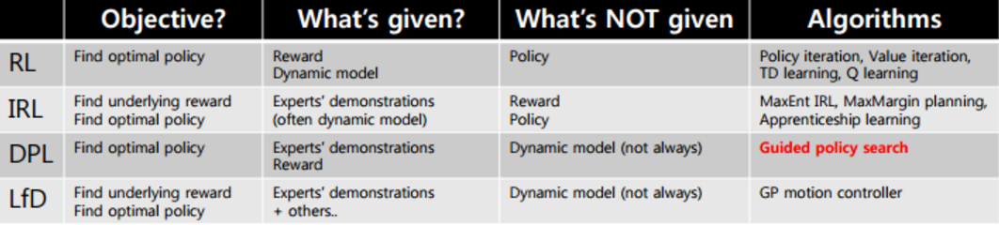

# Inverse Reinforcement Learning（IRL）

我们做增强学习的时候都是对特定任务来手工定义收益函数的思路来完成任务。但是要真正实现稍微智能化的目标，我们更倾向于在不知道具体任务的时候，去观察专家的行为(demonstrated behaviors)然后推测他想干什么(intent)，也就是学习他的收益函数，然后再使用增强学习算法，这也称为逆增强学习。

我们假设Expert的策略就是最好的，根据它的行为策略反推出我们要研究的任务的Reward function。找到Reward function之后，在按照一般的RL问题过程找到最优的actor。这种方法的好处是在某些问题下的Reward function是非常简单的。原则就是 expert 永远是最棒的，是先射箭，再画靶的概念。[8]

数学解释：我们让expert $\hat{\pi}$ 和actor $\pi$ 分别去玩N场游戏, 得到两个大小都为N的状态-行动序列 $\left\{\hat{\tau}_{1}, \hat{\tau}_{2}\right.$
Reward function $\mathrm{R},$ 它必须满足expert的所有尝试分数之和都要比actor的所有尝试分数之和更高：

$$
\sum_{n=1}^{N} R\left(\hat{\tau}_{n}\right)>\sum_{n=1}^{N} R\left(\tau_{n}\right)
$$

## 动机

### 背景

多任务学习：开车不仅仅要考虑最短路径，还要考虑交通状况、红绿灯多寡、甚至路上的风景等等，那么这么多个目标同时在其考虑范围之内，每个目标在完成这个路径的过程中的重要性应该如何权衡？ 有人用这个技术来学开自动驾驶汽车的不同风格。每个人在开车的时候会有不同风格，举例来说，能不能够压到线，能不能够倒退，要不要遵守交通规则等等。每个人的风格是不同的，然后用 Inverse Reinforcement Learning 可以让自动驾驶汽车学会各种不同的开车风格。[7]

学回报函数：自动驾驶中“撞到人”、“撞到车”、“绕开交通拥堵路段”等在人工设置的收益函数里面也很难刻画。特点是，相对手工来做一个收益函数，由人来介绍怎么做会比较容易。[3]即很多时候我们拿不到最优策略，但是获取最优策略的采样数据却是非常容易的。

### 多任务学习

解MOOP最popular的方法就是对给个想满足的目标函数进行normalisation之后，分配适合的权重系数，这个方法称为scalarisation。而如何分配权重，则是MOOP领域出了名的难题。

IRL可以帮我们确定各个任务的相对重要程度。在学习动物行为或者人类行为的时候，回报函数最好是假设为未知，然后从行为案例中学习如何确定多个目标之间的相对权重

MOOP发展了这么多年，其关注点更多的是对一个决策行为的规划，而IRL针对的是sequential decision，是求一系列决策行为的指导原则（reward function）。[3]

### 回报函数难以量化的领域

如果没有reward（回报）的给出，只有专家（或者说大师）的一系列行为记录，是否能让模型模仿学习到大师的级别？（当然就目前的技术，我们需要大量的大师行为记录）。[4]
这些领域一般具备的条件只是一群大概知道回报函数大概得有什么效果和“令人满意”的最优策略长什么样的专家（may have only a very rough idea of the reward function whose optimization would generate "desirable" behavior）。LfD那队问题就是属于这个范畴，我们不想学一个从状态到行为的mapping，而是想学到那个知道专家做出那些决策的reward function。

有了这个假设的价值函数，我们就可以直接套用TRPO的RL算法了。但是这个价值函数不能随便假设，这就回到了我们题目说的GAN+增强学习，没错，用GAN的判别器去判断两个“智能体”（agent）的行为是不是底层逻辑属于同一个价值函数

## 后续

对IRL复原出来的cost function丟进RL中得到一个expert policy, 有
$$
R L \circ I R L_{\psi}\left(\pi_{E}\right)=\underset{\pi \in \Pi}{\arg \min } \psi^{*}\left(p_{\pi}-p_{\pi_{E}}\right)-H(\pi)
$$
说明这个过程得到的policy本质上是在使与专家policy的occupancy measure最小的policy。如果 使 $\psi$ 为scalar, 则 $R L \circ I R L_{\psi}\left(\pi_{E}\right)=\underset{\pi \in \Pi}{\arg \min }\left(p_{\pi}-p_{\pi_{E}}\right)-H(\pi),$ 所以选择的策略 $\pi,$ 使
其与专家policy的occupancy measure即 $p_{\pi_{E}}$ 最小。
如果 $\psi$ 是一个constant function, $\tilde{c} \in I R L_{\psi}\left(\pi_{E}\right), \tilde{\pi} \in R L(\tilde{c}),$ 则有 $p_{\tilde{\pi}}=p_{\pi_{E}}$ 。
总结：整个过程其实就是在说明, $R L \circ I R L$ 这个过程得到的policy, 就是在拟合专家数据中的
occupancy measure 因此问题变为：
$$
\min _{\pi} d_{\psi}\left(p_{\pi}, p_{E}\right)-H(\pi)
$$
选择一个策略 $\pi$ 使得其Occupancy Measure与专家数据的Occupancy Measure尽可能接近, 加一个 entropy term, 希望policy在training过程中尽可能地探索。
所以选择 $d_{\psi}$ 的不同形式, 就可以导出不同的imitation learning的algorithms, 其中 $d_{\psi}$ 选择为下面的公 式
$$
\psi_{\mathrm{GA}}(c) \triangleq\left\{\begin{array}{ll}
\mathbb{E}_{\pi_{E}}[g(c(s, a))] & \text { if } c<0 \\
+\infty & \text { otherwise }
\end{array}\right. \text { where } g(x)=\left\{\begin{array}{ll}
-x-\log \left(1-e^{x}\right) & \text { if } x<0 \\
+\infty & \text { otherwise }
\end{array}\right.
$$
则有：
$$
\begin{aligned}
\min _{\pi} \psi_{G A}^{*}\left(p_{\pi}-p_{\pi_{E}}\right) &=\min _{\pi} \max _{D \in(0,1)^{S \times A}} E_{\pi}[\log D(s, a)]+E_{\pi_{E}}[\log (1-D(s, a))] \\
&=\min _{\pi} D_{J S}\left(p_{\pi}, p_{\pi_{E}}\right)
\end{aligned}
$$

## 对比

### VS 监督学习：模仿学习

监督学习：模仿学习（行为克隆 Behavior Cloning），也就是直接模仿专家的行为而不需要理解其中原因。这也是实践中的一个备选项，在有些时候也能满足要求，尤其是观测数据很多，且域漂移 (domain shift) 比较小的情况；我们得到不是一个可以引导出最优策略的reward function，而是一条固定的策略。

问题：

1. 方法简单并且只能在数据量很大的时候比较有用，因为会由于covariate shift问题产生的compounding error，即只会学习单步的决策，累计将会导致很大的偏离。
2. 机器可能无法完整地学习下来所有信息，可能在有矛盾有噪声时，会选择学习错误的信息。[5]
3. 同时，在Supervised Learning中，我们希望训练集和测试集的数据是同分布的。而在Behavior Cloning中，我们的数据为expert完成任务的过程, 假设其策略为$\hat{\pi}$，对expert做cloning的actor策略设 为 $\pi^{*}$,只要 $\hat{\pi}$ 和 $\pi^{*}$ 有微小的差距，最后就会导致训练和测试的状态集相差巨大，而凭借现有的学习方法又不可能使得machine和expert的策略完全相同。[6]

### VS 学徒学习 Apprenticeship learning

$\min _{\pi} \max _{c \in C} E_{\pi}[c(s, a)]-E_{\pi_{E}}[c(s, a)]$

学徒学习的过程与Inverse RL十分类似，只是它的目标为一个专家policy而不是inverse RL中的cost function。此处有细微的不同：
如果得到的是一个专家的policy，那这个policy很难generalize，非常取决于expert demonstration的数据量以及质量，难以获得超越expert的性能。
但如果是得到一个表示专家intent的reward signal/cost function，将其作为信号，利用RL进行学习的话，会得到一定的灵活性，能获得超越expert的性能，但计算开销比较大。

因为在逆增强学习问题中，我们要尝试去改进收益函数，然而去评估收益函数的时候，我们要求解类似梯度的东西，这其实是正增强学习问题要做的事情，因此有点类似于正增强学习是逆增强学习内循环中的子问题，在样本使用和计算上都很困难。

我们不想学一个从状态到行为的mapping，而是想学到那个知道专家做出那些决策的reward function。
回报函数大概得有什么效果和“令人满意”的最优策略长什么样的专家（may have only a very rough idea of the reward function whose optimization would generate "desirable" behavior）

### 什么叫做一个最好的 reward function。

最后你 learn 出来的 reward function 应该就是 expert 和 actor 在这个 reward function 都会得到一样高的分数。最终你的 reward function 没有办法分辨出谁应该会得到比较高的分数。

通常在 train 的时候，你会 iterative 的去做。那今天的状况是这样，最早的 Inverse Reinforcement Learning 对 reward function 有些限制，它是假设 reward function 是 linear 的。如果 reward function 是 linear 的话，你可以 prove 这个algorithm 会 converge。但是如果不是 linear 的，你就没有办法 prove 说它会 converge。你有没有觉得这个东西，看起来还挺熟悉呢？其实你只要把它换个名字，说 actor 就是 generator，然后说 reward function 就是 discriminator，它就是 GAN。所以它会不会收敛这个问题就等于是问说 GAN 会不会收敛。如果你已经实现过，你会知道不一定会收敛。但除非你对 R 下一个非常严格的限制，如果你的 R 是一个 general 的 network 的话，你就会有很大的麻烦。
## 最大熵逆增强学习 (Max Entropy IRL)

1. 给定 $\psi$, 按照上一篇的方法求出对应的 $\beta\left(\mathbf{s}_{t}, \mathbf{a}_{t}\right)$ 和 $\alpha\left(\mathbf{s}_{t}\right)$ 。
2. 计算访问概率 $\mu_{t}\left(\mathbf{s}_{t}, \mathbf{a}_{t}\right) \propto \beta_{t}\left(\mathbf{s}_{t}, \mathbf{a}_{t}\right) \alpha_{t}\left(\mathbf{s}_{t}\right)$ 。
3. 求解梯度 $\nabla_{\psi} \mathcal{L}=\frac{1}{N} \sum_{i=1}^{N} \sum_{t=1}^{T} \nabla_{\psi} r_{\psi}\left(\mathbf{s}_{i, t}, \mathbf{a}_{i, t}\right)-\sum_{t=1}^{T} \iint \mu_{t}\left(\mathbf{s}_{t}, \mathbf{a}_{t}\right) \nabla_{\psi} r_{\psi}\left(\mathbf{s}_{t}, \mathbf{a}_{t}\right) \mathrm{d} \mathbf{s}_{t} \mathrm{~d} \mathbf{a}_{t}$
4. 走一个梯度步 $\psi \leftarrow \psi+\eta \nabla_{\psi} \mathcal{L}$ 。

这个是表格形式的最大熵逆增强学习的算法。该思想由Ziebart et al. (2008) 发表在AAAI上 的"Maximum Entropy Inverse Reinforcement Learning"提出。之所以称为最大嫡, 因为原理 其实与上一篇中的嫡正则化类似。我们可以说明如果我们的 $r_{\psi}\left(\mathbf{s}_{t}, \mathbf{a}_{t}\right)=\psi^{\top} \mathbf{f}\left(\mathbf{s}_{t}, \mathbf{a}_{t}\right)$ 是这样的线性形式, 那么其实这样的算法是在最优化 $\max _{\psi} \mathcal{H}\left(\pi^{r} \psi\right)$ s.t. $\mathbf{E}_{\pi^{\prime} \psi}[\mathbf{f}]=\mathbf{E}_{\pi^{*}}[\mathbf{f}],$ 在保证学习的策略的特征和专家策略特征一致的基础上使得策略的熵最大。

期望利用专家的行动轨迹 $\zeta=\left\{s_{i}, a_{i}\right\}_{N}$ 学一个回报函数 $r\left(f_{s_{j}} ; \theta\right),$ 其中 $f_{s_{j}}$ 是状态的特征抽 取, $\theta$ 是回报函数的参数， 如果回报函数与特征之间是线性关系，则可表示为如下形式：
$$
r\left(\boldsymbol{f}_{s_{j}}\right)=\theta^{\mathrm{T}} \boldsymbol{f}_{s_{j}}=\sum_{i} \theta_{i} \boldsymbol{f}_{i}
$$
此时某条轨迹\zeta的累计回报可以写作：
$$
r\left(f_{\zeta}\right)=\sum_{s_{j} \in \zeta} \theta^{\mathrm{T}} f_{s_{j}}=\theta^{\mathrm{T}} \sum_{s_{j} \in \zeta} f_{s_{j}}=\theta^{\mathrm{T}} f_{\zeta}
$$
假设所有的轨迹起始于同一个状态, 将每一条轨迹 $\tilde{\zeta}$ 聚合起来，就可以用这些轨迹得到价值期望 的估计：
$$
v(\boldsymbol{f})=E_{\tilde{\zeta}_{i}}\left[r\left(f_{\tilde{\xi}_{i}}\right)\right] \simeq \frac{1}{m} \sum_{i} \theta^{\mathrm{T}} \boldsymbol{f}_{\xi_{i}}=\theta^{\mathrm{T}} \frac{1}{m} \sum_{i} f_{\tilde{\zeta}_{i}}=\theta^{\mathrm{T}} \tilde{\boldsymbol{f}}
$$
假定策略模型为 $P_{\pi}\left(\zeta_{i}\right),$ 我们希望策略模型交互得到的轨迹的累计回报等于专家轨迹的累计回
报：
$$
E_{\zeta_{i} \sim \pi}\left[r\left(f_{\zeta}\right)\right]=\theta^{\mathrm{T}} \sum_{i} P_{\pi}\left(\zeta_{i}\right) f_{\zeta_{i}}=\theta^{\mathrm{T}} \tilde{f}
$$
由于等式两边 $\theta$ 相同，可以得到：
$$
\sum_{i} P_{\pi}\left(\zeta_{i}\right) f_{\zeta_{i}}=\frac{1}{m} \sum_{i} f_{\tilde{\zeta}_{i}}
$$
上述这个约束条件并不是很强的一个约束, 满足这个约束的策略模型 $P_{\pi}\left(\zeta_{i}\right)$ 可能有很多，而这些 策略在完整的问题空间中可能各有优劣， 因此在完整的问题空间中仍然可能得到一个较差模型。

### Maximum Entropy Deep Inverse Reinforcement Learning

Wulfmeier et al. (2015) 的"Maximum Entropy Deep Inverse Reinforcement Learning"及其应用，Wulfmeier et al. (2016) 发表在IROS上的"Watch This: Scalable Cost-Function Learning for Path Planning in Urban Environments"也使用了类似的方法，还是使用了表格的形式，但是收益函数的设置更复杂，是一个用神经网络来对若干人工特征进行非线性组合的形式，算法本质上和最大熵逆增强学习没有区别，只是需要用神经网络来计算收益，最后需要用梯度去更新的也是神经网络。注意这个问题中状态空间只是一个二维平面，行动空间是离散的方向。该方法的主要局限性是仍然需要迭代求解MDP，而且还需要假设系统动态是已知的。

Algorithm 1 Maximum Entropy Deep IRL
Input: $\mu_{D}^{a}, f, S, A, T, \gamma$
Output: optimal weights $\theta^{*}$
$1: \theta^{1}=$ initialise_weights ()
Iterative model refinement
2: for $\mathrm{n}=1: \mathrm{N}$ do
3: $\quad r^{n}=$ nn_forward $\left(f, \theta^{n}\right)$
Solution of MDP with current reward
4: $\quad \pi^{n}=$ approx_value_iteration $\left(r^{n}, S, A, T, \gamma\right)$
5: $\quad \mathbb{E}\left[\mu^{n}\right]=$ propagate_policy $\left(\pi^{n}, S, A, T\right)$
Determine Maximum Entropy loss and gradients
6: $\quad \mathcal{L}_{D}^{n}=\log \left(\pi^{n}\right) \times \mu_{D}^{a}$
7: $\quad \frac{\partial \mathcal{L}_{D}^{n}}{\partial r^{n}}=\mu_{D}-\mathbb{E}\left[\mu^{n}\right]$
Compute network gradients
8: $\quad \frac{\partial \mathcal{L}_{D}^{n}}{\partial \theta_{D}^{n}}=$ nn_backprop $\left(f, \theta^{n}, \frac{\partial \mathcal{L}_{D}^{n}}{\partial r^{n}}\right)$
9: $\quad \theta^{n+1}=$ update_weights $\left(\theta^{n}, \frac{\partial \mathcal{L}_{D}^{n}}{\partial \theta_{D}^{n}}\right)$
10: end for

## 深度逆增强学习

要处理深度逆增强学习问题，我们希望能适应离散较大的甚至是连续的状态行动空间，而且我们需要对系统动态未知的情况下做有效的学习。

假设我们不知道系统动态，但可以像普通增强学习一样抽样。

注意到我们前面对数似然函数的梯度 $\nabla_{\psi} \mathcal{L}=\mathbf{E}_{x \sim \pi^{*}(x)}\left[\nabla_{\psi} r_{\psi}(x)\right]-\mathbf{E}_{x \sim p\left(x \mid \mathcal{O}_{1: T, \psi}\right)}\left[\nabla_{\psi} r_{\psi}(x)\right],$ 前者是专家样本数据中得到的, 后者是当前收益函数对应最优策略下的。

要做到后者, 一个比较直接的想法是使用任何最大嫡增强学习方法学习出策略 $p\left(\mathbf{a}_{t} \mid \mathbf{s}_{t}, \mathcal{O}_{1: T}, \psi\right),$ 然后根据这个策略来采集 $\left\{x_{j}\right\}$ 。此时，就用专家样本的结果减掉新抽 样本的结果, $\nabla_{\psi} \mathcal{L} \approx \frac{1}{N} \sum_{i=1}^{N} \nabla_{\psi} r_{\psi}\left(x_{i}\right)-\frac{1}{M} \sum_{j=1}^{M} \nabla_{\psi} r_{\psi}\left(x_{j}\right)$ 来做无偏估计。

然而事实上这种学习的做法是代价很高的, 因为我们不假定有模型, 所以可能要用无模型的增强学习算法, 这将使得每一 步都花掉很多很多时间。这里我们可以采用一些小技巧，我们可以不用完全地把对应的最优策略学 出来，而只是每次把策略改进一点点, 然后用这个不准确的策略去近似估计梯度。然而现在多出来 个问题, 由于我们使用的策略是不正确的 (不是最优的策略)， 因此我们的估计量将不再无偏。

对于分布错误的问题, 一个有力武器是重要性抽样（我们在策略梯度法部分有过介绍 $) ，$ 用其他分 布下抽样结果来得到正确分布下的无偏估计： $\nabla_{\psi} \mathcal{L} \approx \frac{1}{N} \sum_{i=1}^{N} \nabla_{\psi} r_{\psi}\left(x_{i}\right)-\frac{1}{\sum_{j} w_{j}} \sum_{j=1}^{M} w_{j} \nabla_{\psi} r_{\psi}\left(x_{j}\right)$
其中权重为 $w_{j}=\frac{p\left(x_{j}\right) \exp \left(r_{\psi}\left(x_{j}\right)\right)}{\pi\left(x_{j}\right)},$ 分子正比于收益的指数（我觉得Levine教授原文
$w_{j}=\frac{\exp \left(r_{\psi}\left(x_{j}\right)\right)}{\pi\left(x_{j}\right)}$ 少了一个概率, 无法推导成下面的形式, 或者是可能它的定义和我上面说的不同了，请评论区大神帮忙研究下)， 分母是现在分布的概率。

因为我们前面会除以权重之和, 就不需要关注 $w_{j}$ 归一化的问题。使用之前策略梯度法一样的展开，对同一条 $x_{j},$ 我们得到 $w_{j}=\frac{p\left(\mathbf{s}_{1}\right) \prod_{t} p\left(\mathbf{s}_{t+1} \mid \mathbf{s}_{t}, \mathbf{a}_{t}\right) \exp \left(r_{\psi}\left(\mathbf{s}_{t}, \mathbf{a}_{t}\right)\right)}{p\left(\mathbf{s}_{1}\right) \prod_{t} p\left(\mathbf{s}_{t-1} \mid \mathbf{s}_{t}, \mathbf{a}_{t}\right) \pi\left(\mathbf{a}_{t} \mid \mathbf{s}_{t}\right)}=\frac{\exp \left(\sum_{t} r_{\psi}\left(\mathbf{s}_{t}, \mathbf{a}_{t}\right)\right)}{\prod_{t} \pi\left(\mathbf{a}_{t} \mid \mathbf{s}_{t}\right)}$ 这样比较简单的形式。

进一步，最优下 $\pi(x) \propto p(x) \exp \left(r_{\psi}(x)\right),$ 无需做IS。每一步策略迭代都使我们更接近最优分布，因此事实 上是在逐步改进的。。

### 引导代价学习 (guided cost learning)

Finn et al. (2016) 发表在ICML上的文章"Guided Cost Learning: Deep Inverse Optimal Control via Policy Optimization" 提出了引导代价学习 (guided cost learning) 算法。需要给定一些人工的示范，然后算法从一个随机的策略[公式] 开始，通过运行策略[公式]去生成随机样本，然后使用重要性抽样和人工示范的方式来更新收益函数，根据收益函数稍微更新一下分布，然后下一阶段的分布更好。最后，我们得到了最终的类似于专家的收益函数和对应的策略。事实上，这个文章中使用了基于模型的算法中的GPS算法来做策略更新，然而事实上任何改进策略的方法应当都是适用的。她们的文章中使用这样的方法来“教”机器人完成人工动手的操作如摆放盘子和往目标杯子里倒水。这项工作相对更早期的逆增强学习算法，如Kalakrishnan et al. (2013) "Learning Objective Functions for Manipulation" 的路径积分IRL (path integral IRL) 和Boularias et al. (2011) "Relative Entropy Inverse Reinforcement Learning" 的相对熵IRL (relative entropy IRL) 的思路的改进主要在于，早期的算法虽然使用了重要性抽样，但是没有下面的那个箭头，没有对策略进行更新，也因此只得到收益函数而不产生最终的策略。但是早期算法如果在初始分布不错的情况下（要求可能较高），也是可以得到一些不错效果的。她们比较了手工设计的收益函数，相对熵IRL和GCL算法的效果。

事实上，很可能我们得到的收益函数不是一个很好的收益函数，但是往往这个策略函数反倒还可以。

## 与生成对抗网络 (GAN) 的联系

IRL是从专家示范中推断出未知收益函数的手段， 一类比较好用的IRL算法是最大熵IRL，相对类似超平面分割的方法来说可以消除歧义，也解决了人类示范可能不是最优这种情况。

Finn et al. (2016) 发表于NIPS的文章 "A Connection between Generative Adversarial Networks, Inverse Reinforcement Learning, and Energy-Based Models" 进行一个对比，IRL中的轨迹对应着GAN中的样本，IRL中的策略对应着GAN中的生成器（生成轨迹和样本），而IRL收益函数则对应了GAN中的判别器。

## 基于能量的模型 (energy-based models, EBM) 的联系

事实上它和GCL是差不多的，只是GCL的D是一个给定的函数形式，而这边D是一个二分类器（因此该算法不是IRL，但是非常像），总体来说两个算法都是GAN的变种。

$$
p_{\theta}(x)=\frac{1}{Z} \exp \left(-E_{\theta}(x)\right)
$$

难点出现在partition function Z的评估中, 而使用了 $E_{\theta}(x)$ 就是Energy Function采用了Cost Function来对轨迹 $x$ 建模, 而轨迹的分布采用了Boltzmann Distribution的形式即 $p_{\theta}(x)$ 进行表达, 常常以最大似然的方法来确定参数 $\theta$ 。

(论文采用了控制论上cost的方式表述, 但实际上是reward等同，即负的reward, 不再强调)

$$
Z=\int \exp \left(-E_{\theta}(x)\right) d x
$$

### GCL

#### 建模轨迹—PGM

GCL建模了专家数据（expert trajectories），并天真地以为是optimal behaviors，引入了一个optimality variable来专门对专家行为进行建模：

$\begin{aligned} p\left(O_{t} \mid s_{t}, a_{t}\right) &=\exp \left(r\left(s_{t}, a_{t}\right)\right)=\exp \left(-c\left(s_{t}, a_{t}\right)\right) \\ p\left(x \mid O_{1: T}\right)=\frac{p\left(x, O_{1: T}\right)}{p\left(O_{1: T}\right)} & \propto p\left(x, O_{1: T}\right) \\ &=p(x) p\left(O_{1: T} \mid x\right) \\ &=p(x) \exp \left(\sum_{t=1}^{T} r\left(s_{t}, a_{t}\right)\right) \\ &=\left[p\left(s_{1}\right) \prod_{t=1}^{T} p\left(s_{t+1} \mid s_{t}, a_{t}\right)\right] \exp \left(\sum_{t=1}^{T} r\left(s_{t}, a_{t}\right)\right) \end{aligned}$

中的policy没了? 因为这个是基于PGM的建模, 专家数据中直接就有 state与action, 不需要去管state与action之间的映射。如图:
那现在我们想要参数化的是reward function, 因此有

$$
\begin{aligned}
p\left(x \mid O_{1: T}, \psi\right) & \propto p(x) \exp \left(\sum_{t=1}^{T} r_{\psi}\left(s_{t}, a_{t}\right)\right) \\
&=p(x) \exp \left(r_{\psi}(x)\right)
\end{aligned}
$$

现在有专家数据 $x^{(i)}，用Maximum Likelihood Learning去学习reward:

$$
\max _{\psi} L(\psi)=\max _{\psi} \frac{1}{N} \sum_{i=1}^{N} \log p\left(x^{(i)} \mid O_{1: T}, \psi\right)=\max _{\psi} \frac{1}{N} \sum_{i=1}^{N} r_{\psi}\left(x^{(i)}\right)-\log Z
$$
$$
Z=\int p(x) \exp \left(r_{\psi}(x)\right) d x
$$

####

, 自然就是希望学习一个关于专家的轨迹分布 $p_{\theta}(x)$, 即求解参数 $\theta$

$$
\begin{aligned}
L_{c o s t}(\theta) &=E_{x \sim p}\left[-\log p_{\theta}(x)\right] \\
&=E_{x \sim p}\left[c_{\theta}(x)\right]+\log Z \\
&=E_{x \sim p}\left[c_{\theta}(x)\right]+\log \left(E_{x \sim q}\left[\frac{\exp \left(-c_{\theta}(x)\right)}{q(x)}\right]\right)
\end{aligned}
$$

看了GCL的Paper精读就知道，在估计Z的时候采用了Policy的构建方式来对轨迹trajectory进行逼 近, 并用了Importance Sampling的形式来使用 $q(x)$ 的轨迹样本数据进行基于Samples的估计。

因为Importance Sampling的分布 $q(x)$ 一开始没有交集的话, 这个weight就会有coverage的问题, 加入一些专家数据有:
$$
\begin{array}{c}
u=\frac{1}{2} p+\frac{1}{2} q \\
L_{\operatorname{cost}}(\theta)=E_{x \sim p}\left[c_{\theta}(x)\right]+\log \left(E_{x \sim u}\left[\frac{\exp \left(-c_{\theta}(x)\right)}{\frac{1}{2} p_{\theta}(x)+\frac{1}{2} q(x)}\right]\right)
\end{array}
$$
实现了对Cost的更新后, 还需要将Policy构建的轨迹分布 $q(x)$ 用KL散度来拉近与专家数据分布 $p_{\theta}(x)$ 的距离。即

$$
\min _{q} L(q)=\min _{q} E_{x \sim q}\left[c_{\theta}(x)\right]+E_{x \sim q}[\log q(x)]
$$

选择policy构建的轨迹分布 $q(x)$ 在当前 $c_{\theta}(x)$ 下的cost最低, 然后最大化 $q(x)$ 的Entropy即 $H[q(x)]=$ $E_{x \sim q}[-\log q(x)],$ 从而使得 $q(x)$ 的分布更“broad”（最大化分布的entropy就是使其分布更宽广 ）。

### GCL VS GAN

1. GCL迭代的是两个对象, 一个是Cost Function即 $c_{\theta}(x)$, 轨迹用的是PGM的方式进行构建; 另一个是Policy对象即 $q(x),$ 轨迹用的是Policy的方式进行构建。。
2. GCL中学习参数 $\theta$ 的目标为：

$$
L_{c o s t}(\theta)=E_{x \sim p}\left[c_{\theta}(x)\right]+\log \left(E_{x \sim u}\left[\frac{\exp \left(-c_{\theta}(x)\right)}{\frac{1}{2} p_{\theta}(x)+\frac{1}{2} q(x)}\right]\right)
$$

3. 用最大似然估计MLE来近似专家数据, 用Policy来处理log $Z$
GCL中学习Policy分布的目标为：

$$
\min _{q} L(q)=\min _{q} E_{x \sim q}\left[c_{\theta}(x)\right]+E_{x \sim q}[\log q(x)]
$$

就是一个MaxEntIRL目标，使q在当前reward下取得损失最小，同时使q分布尽可能宽广。

## 总结[1]

IRL是从专家示范中推断出未知收益函数的手段， 一类比较好用的IRL算法是最大熵IRL，相对类似超平面分割的方法来说可以消除歧义，也解决了人类示范可能不是最优这种情况。这类算法可以用表格动态规划来实现，比较简单有效，但是只有在状态行动空间较小，动态已知的情况下才能应用。有一类微分最大熵IRL这边没有涉及，它适合于大而连续的空间，但需要知道系统动态。我们这里讲的深度IRL使用的是基于样本的最大熵IRL，可以用于连续空间，可以不假设有模型存在，较广泛。它的实现可以用GCL算法，该算法与GAN也有很深的渊源，和它紧密相关的还有生成对抗模仿学习算法（但不是IRL，不推测收益函数）。

[1]: https://zhuanlan.zhihu.com/p/33663492
[2]: https://github.com/
[3]: https://zhuanlan.zhihu.com/p/44907527
[4]: http://nooverfit.com/wp/gan%E5%A2%9E%E5%BC%BA%E5%AD%A6%E4%B9%A0-%E4%BB%8Eirl%E5%92%8C%E6%A8%A1%E4%BB%BF%E5%AD%A6%E4%B9%A0-%E8%81%8A%E5%88%B0trpo%E7%AE%97%E6%B3%95%E5%92%8Cgail%E6%A1%86%E6%9E%B6-david-9%E6%9D%A5%E8%87%AA/
[5]: https://blog.csdn.net/weixin_42815609/article/details/108022965
[6]: https://blog.csdn.net/weixin_42770354/article/details/109853524
[7]: https://datawhalechina.github.io/leedeeprl-notes/#/chapter11/chapter11
[8]: https://datawhalechina.github.io/leedeeprl-notes/#/chapter11/chapter11?id=recap-sentence-generation-amp-chat-bot

TODO:https://rebornhugo.github.io/reinforcement%20learning/2018/05/20/Inverse-Reinforcement-Learning/#more

事实上, 可以令GAN的判别器取决于收益的方式来完成类似的目标。假设一个轨迹在专家（数据）分布下的概率是 $p(x),$ 当前策略下的概率是 $q(x),$ 最优判别器应该为 $D^{*}(x)=\frac{p(x)}{p(x)+q(x)}$ 。 在IRL中，我们假设专家分布下的概率是 $\frac{1}{Z} \exp \left(R_{\psi}\right),$ 从而 $D_{\psi}(x)=\frac{\frac{1}{Z} \exp \left(R_{\psi}\right)}{\frac{1}{Z} \exp \left(R_{\psi}\right)+q(x)}$ 。我们的判
别器要最小化损失函数 (reward/discriminator optimizaion) $\mathcal{L}_{\text {discriminator }}(\psi)=\mathbf{E}_{x \sim p}\left[-\log D_{\psi}(x)\right]+\mathbf{E}_{x \sim q}\left[-\log \left(1-D_{\psi}(x)\right)\right],$ 简单说就是使得对应分布下的似然最大，这也是IRL的目标函数。

我们的生成器要最小化损失函数 (policy/generator optimization) $\mathcal{L}_{\text {generator }}(\theta)=\mathbf{E}_{x \sim q}\left[\log \left(1-D_{\psi}(x)\right)-\log D_{\psi}(x)\right]=\mathbf{E}_{x \sim q}\left[\log q(x)+\log Z-R_{\psi}(x)\right]$
使得在当前分布下判别器尽可能分不清, 这个结论和上篇中的嫡正则化的增强学习的结论是很相 似的。对于未知的系统动态，我们交替进行策略更新来最大化收益函数，然后进行收益更新来提高 样本收益且降低当前策略收益, 也是类似这样的过程。GCL算法中，机器人尝试的收益函数是要去 最小化的, 人类示范的收益函数是要去最大化的，去尝试学习最大嫡模型的分布 $p(x) \propto \exp (r(x))$ 此外, 一个有趣的交汇是, IRL也和基于能量的模型 (energy-based models, EBM) 很有关系。
Ho and Ermon (2016) 发表在NIPS上的 "Generative adversarial imitation learning" 一文将
一个二分类器来表示轨迹是一个正样本的概率, 并使用 $\log D(x)$ 作为收益函数。事实上它和GCL是 差不多的, 只是GCL的D是一个给定的函数形式, 而这边D是一个二分类器（因此该算法不是IRL, 但是非常像 $) ，$ 总体来说两个算法都是GAN的变种。。
