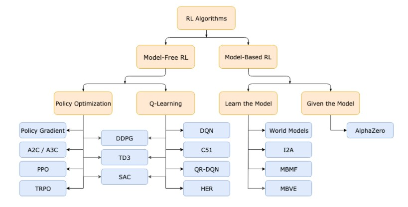

<!--
 * @version:
 * @Author:  StevenJokess https://github.com/StevenJokess
 * @Date: 2020-10-05 22:08:57
 * @LastEditors:  StevenJokess https://github.com/StevenJokess
 * @LastEditTime: 2020-12-27 20:38:02
 * @Description:
 * @TODO::
 * @Reference:[1]: https://spinningup.readthedocs.io/zh_CN/latest/spinningup/rl_intro.html#bellman-equations
 * [2]: https://nndl.github.io/ ch14
 * [3]: https://anesck.github.io/M-D-R_learning_notes/RLTPI/notes_html/1.chapter_one.html
 * [4]:
-->

# 强化学习

当我们思考学习的本质时，我们首先想到的是通过与环境交互来学习。 当一个婴儿玩耍，挥动手臂或环顾四周时，他没有明确的老师，但他确实通过直接的感觉与环境联系。 他可以通过这种联系获得大量关于因果关系、动作的结果以及如何实现目标的信息。 在我们的生活中，这种交互无疑是环境和自身知识的主要来源。 无论我们是学习驾驶汽车还是进行交谈，我们都敏锐地意识到我们的环境如何响应我们的行为，并且我们试图通过我们的行为来影响所发生的事情。 从交互中学习是几乎所有学习和智能理论的基本思想。[4]

即使是专家也很难给出“正确”的动 作，二是获取大量数据的成本往往比较高．对于下棋强化学习我们很难知 道每一步的“正确”动作，但是其最后的结果（即赢输）却很容易判断．因此，如果 可以通过大量的模拟数据，通过最后的结果（奖励）来倒推每一步棋的好坏，从 而学习出“最佳”的下棋策略，这就是强化学习．

强化学习（ReinforcementLearning，RL），也叫增强学习，是指一类从（与 环境）交互中不断学习的问题以及解决这类问题的方法．强化学习问题可以描 述为一个智能体从与环境的交互中不断学习以完成特定目标（比如取得最大奖励值。和深度学习类似，强化学习中的关键问题也是贡献度分配问题[Minsky, 1961]，每一个动作并不能直接得到监督信息，需要通过整个模型的最终监督信息（奖励）得到，并且有一定的延时性

强化学习是一种学习如何将状态映射到动作，以获得最大奖励的学习机制。 学习者不会被告知要采取哪些动作，而是必须通过尝试来发现哪些动作会产生最大的回报。 在最有趣和最具挑战性的案例中，动作不仅可以影响直接奖励，还可以影响下一个状态，并通过下一个状态，影响到随后而来的奖励。 这两个特征 - 试错法和延迟奖励 - 是强化学习的两个最重要的可区别特征。[4]

唯一目标是最大化Reward

## 基本概念[3]

智能体 (Agent):强化学习系统中的行动者和学习者，它可以做出决策和接受奖励信号，我们并不需要对智能体本身进行建模，只需了解它在不同环境下可以做出的动作，并接受奖励信号。
环境 (Environmen):强化学习系统中除智能体以外的所有事物，它是智能体交互的对象。环境可以是已知的，也可以是未知的，因此可以对环境建模，也可以不对环境建模。

奖励 (Reward):奖励是强化学习系统的学习目标。$R_{t}$是 $t$ 时刻的奖励。，智能体agent在采取行动后会收到环境发来的奖励，而强化学习的目标就是要最大化长时间里的累积的（cumulative）的总奖励。
观察 (Observation):$O_{t}, t$ 时刻对环境的观察。
行动 (Action):$A_{t}, t$ 时刻采取的行动。

历史 (History):是一个序列的观察/奖励/行动（某刻之前的所有时刻）。 $H_{t}=A_{1}, O_{1}, R_{1}, \ldots A_{t}, O_{t}, R_{t_{0}}$
状态 (State):通过对历史信息的总结, 决定接下来要发生什么。 $S_{t}=f\left(H_{t}\right)$
环境状态 (Environment State)：某个环境的状态, $S_{t 。}^{e}$
代理状态（Agent State）： agent内部的环境, $S_{t 。}^{a}$

马尔科夫状态:状态 $S_{t}$ 是马尔科夫状态，如果满足：$P\left[S_{t+1} \mid S_{t}\right]=P\left[S_{t+1} \mid S_{1}, \ldots, S_{t}\right],$到这一步可以把历史丟掉了, 只要每一步的状态即可。

全观测环境 (Full observability) $: O_{t}=S_{t}^{a}=S_{t .}^{e}$
部分观测环境 (Partial observability): $S_{t \circ}^{e}$

策略(Policy):策略为强化学习的学习对象。策略会指导智能体根据当前环境来采取动作（是 state 到 action 的映射。），策略可以是确定性的（确定形式 : $a=\pi(s) ;$ ），也可以是不确定性的（概率分布）（随机形式 : $\pi(a \mid s)=P\left[A_{t}=a \mid S_{t}=s\right]_{\circ}$），强化学习通过改进策略来最大化总奖励。
价值(Value): Value是对未来reward的预测 : $v_{\pi}(s)=E_{\pi}\left[R_{t+1}+\gamma R_{t+2}+\gamma^{2} R_{t+3}+\ldots .1 S_{t}=s\right]$
模型(Model): Model是对未来环境的预测： P预测下一个state: $\mathbf{P}_{s s}^{a}=P\left[S_{t+1}=s^{\prime} \mid S_{t}=s, A_{t}=a\right], \mathbf{R}$
预测下一个即时的奖励: $\mathbf{R}_{s}^{a}=E\left[R_{t+1} \mid S_{t}=s, A_{t}=a\right]_{\circ}$

Agent 分类：[8]

- model based（model + policy and/or + value function）
- model free:
  1. value based (value function)
  2. policy based (policy)
  3. actor critic (policy + value function)

## VS ML

Standard (supervised) machine learning:
Usually assumes:
• i.i.d. data
• known ground truth outputs in training

Reinforcement learning:
• Data is not i.i.d.: previous outputs influence future inputs! • Ground truth answer is not known, only know if we succeeded or failed • more generally, we know the reward

## 术语：

状态和观察(states and observations)
动作空间(action spaces)
策略(policies)
行动轨迹(trajectories)
不同的回报公式(formulations of return)
强化学习优化问题(the RL optimization problem)
值函数(value functions)

机性策略
深度强化学习中最常见的两种随机策略是 绝对策略 (Categorical Policies) 和 对角高斯策略 (Diagonal Gaussian Policies)。

策略 智能体的策略（Policy）就是智能体如何根据环境状态𝑠来决定下一步的 动作𝑎，通常可以分为确定性策略（Deterministic Policy）和随机性策略（StochasticPolicy）两种[2]

贝尔曼方程

𝑉𝜋(𝑠) = 𝔼𝜏0∶𝑇∼𝑝(𝜏)[𝑟1+ 𝛾𝑇−1∑𝑡=1𝛾𝑡−1𝑟𝑡+1|𝜏𝑠0= 𝑠](14.15)
= 𝔼𝑎∼𝜋(𝑎|𝑠)𝔼𝑠′∼𝑝(𝑠′|𝑠,𝑎)𝔼𝜏1∶𝑇∼𝑝(𝜏)[𝑟(𝑠,𝑎,𝑠′) + 𝛾𝑇−1∑𝑡=1𝛾𝑡−1𝑟𝑡+1|𝜏𝑠1= 𝑠′](14.16)
= 𝔼𝑎∼𝜋(𝑎|𝑠)𝔼𝑠′∼𝑝(𝑠′|𝑠,𝑎)[𝑟(𝑠,𝑎,𝑠′) + 𝛾𝔼𝜏1∶𝑇∼𝑝(𝜏)[𝑇−1∑𝑡=1𝛾𝑡−1𝑟𝑡+1|𝜏𝑠1= 𝑠′]](14.17)
= 𝔼𝑎∼𝜋(𝑎|𝑠)𝔼𝑠′∼𝑝(𝑠′|𝑠,𝑎)[𝑟(𝑠,𝑎,𝑠′) + 𝛾𝑉𝜋(𝑠′)].(14.18)

表示当前状态的值函数可以通过下个状态的值函数来计算．贝尔曼方程因其提出者、美国国家科学院院士、动态规划创始人理查德·贝尔曼（RichardBellman，1920～1984）而得名，也叫作“动态规划方程”．如果给定策略𝜋(𝑎|𝑠)，状态转移概率𝑝(𝑠′|𝑠,𝑎)和奖励𝑟(𝑠,𝑎,𝑠′)，我们就可以通过迭代的方式来计算𝑉𝜋(𝑠)．由于存在折扣率，迭代一定步数后，每个状态的值函数就会固定不变．

## 优势函数（Advantage Functions）

强化学习中，有些时候我们不需要描述一个行动的绝对好坏，而只需要知道它相对于平均水平的优势。也就是说，我们只想知道一个行动的相对 优势 。这就是优势函数的概念。

一个服从策略 \pi 的优势函数，描述的是它在状态 s 下采取行为 a 比随机选择一个行为好多少（假设之后一直服从策略 \pi ）。数学角度上，优势函数的定义为：

## 马尔科夫决策

我们使用动态规划理论的思想来规范化强化学习的问题，具体地说，是不完全已知的马尔可夫决策过程的最优控制。

马尔科夫决策过程指的是服从 马尔科夫性 的系统： 状态转移只依赖与最近的状态和行动，而不依赖之前的历史数据。

是一个序列化过程，在时刻t，智能体基于当前状态St发出动作At，环境做出回应，生成新的状态St+1和对应的奖励值Rt+1，这里需要强调一点，状态S和奖励值R是成对出现的。智能体的目标就是，通过更加明智地执行动作，从而最大化接下来的累计奖励Gt，公式表示如

T=t+k+1表示最后的时间步，也就意味着在时刻智能体同环境的交互过程结束，这个开始到结束的过程称作一个“轮回（episode）”。当前轮回结束后，智能体的状态会被重置，从而开始一个新的轮回，因此，所有的轮回之间是相互独立

强化学习的主流算法[3]

免模型学习（Model-Free） vs 有模型学习（Model-Based）

在介绍详细算法之前，我们先来了解一下强化学习算法的2大分类。这2个分类的重要差异是：智能体是否能完整了解或学习到所在环境的模型

有模型学习（Model-Based）对环境有提前的认知，可以提前考虑规划，但是缺点是如果模型跟真实世界不一致，那么在实际使用场景下会表现的不好。

免模型学习（Model-Free）放弃了模型学习，在效率上不如前者，但是这种方式更加容易实现，也容易在真实场景下调整到很好的状态。所以免模型学习方法更受欢迎，得到更加广泛的开发和测试。
主流的分类

注：同策学习（on-policy）是边决策边学习，学习者同时也是决策者。异策学习（off-policy）则是通过之前的历史（可是自己的也可以是别人的）进行学习，学习者和决策者不需要相同。[3]

## 强化学习和监督学习、无监督学习的区别[5]

1. 监督式学习就好比你在学习的时候，有一个导师在旁边指点，他知道怎么是对的怎么是错的。

   强化学习会在没有任何标签的情况下，通过先尝试做出一些行为得到一个结果，通过这个结果是对还是错的反馈，调整之前的行为，就这样不断的调整，算法能够学习到在什么样的情况下选择什么样的行为可以得到最好的结果。

2. 监督式学习出的是之间的关系，可以告诉算法什么样的输入对应着什么样的输出。监督学习做了比较坏的选择会立刻反馈给算法。一般希望是独立同分布的。

   强化学习出的是给机器的反馈 reward function，即用来判断这个行为是好是坏。 另外强化学习的结果反馈有延时，有时候可能需要走了很多步以后才知道以前的某一步的选择是好还是坏。

3. 监督学习的输入是独立同分布的。

   强化学习面对的输入总是在变化，每当算法做出一个行为，它影响下一次决策的输入。

4. 监督学习算法不考虑这种平衡，就只是 exploitative。

   强化学习，一个 agent 可以在探索和开发（exploration and exploitation）之间做权衡，并且选择一个最大的回报。

5. 非监督式不是学习输入到输出的映射，而是试图找到隐藏的结构或模式(自动映射)。

   对强化学习来说，它通过对没有概念标记、但与一个延迟奖赏或效用（可视为延迟的概念标记）相关联的训练例进行学习，以获得某种从状态到行动的映射并获得最大化奖励信号[7]。

**强化学习和前二者的本质区别**:没有前两者具有的明确数据概念，它不知道结果，只有目标。数据概念就是大量的数据，有监督学习、无监督学习需要大量数据去训练优化你建立的模型。监督学习有反馈，无监督学习无反馈，强化学习是执行多步之后才反馈。

|      | 监督学习         | 非监督学习     | 强化学习|
| ---- | ---------------- | ------------- | ------ |
| 标签 | 正确且严格的标签 | 没有标签       | 没有标签、supervisor，通过有延迟的结果反馈调整 |
| 输入 | 独立同分布       | 独立同分布     | 输入总是在变化，每当算法做出一个行为，它影响下一次决策的输入。 |
| 输出 | 输入对应输出     | 自学习映射关系 | reward function，即结果用来判断这个行为是好是坏；有试错机制：Trial-and-error，即存在exploration和exploitation的平衡 (不一定按照已知的最优做法去做)             |

## 探索和利用（Exploration and Exploitation）[6]

agent只有尝试过某个动作才能知道会发生什么。所以agent既要探索，又要利用。用一个经典例子解释一下这两个概念。

假如我们去餐馆吃饭：探索就是去一个新的餐馆。利用就是在去过的餐馆中挑一个最好吃的。探索有可能找到一个更好吃的，但也有不好吃的风险。
假如我们做广告：探索就是利用当下最成功的打广告方案。利用就是想一个全新的方案。

## 强化学习的要素[7]

在个体和环境之外，强化学习系统一般有四个要素：策略，奖励信号，价值函数，和可选的环境 模型。

策略 定义了学习个体在给定时间内的行为方式。 简单来说，策略是从感知的环境状态到在这些状态下要采取的行动的映射。 它对应于心理学中所谓的一组刺激-反应规则或关联。 在某些情况下，策略可以是简单的函数或查找表格，而在其他情况下，它可能涉及广泛的计算，例如搜索过程。 策略是强化学习个体的核心，因为它本身就足以确定行为。一般来说，策略对指定每个动作的概率而言可以是随机的。

奖励信号 定义了强化学习问题的目标。 在每个时间步骤，环境向强化学习个体发送的单个数字称为 奖励。 个体的唯一目标是最大化其长期收到的总奖励。 因此，奖励信号定义了相对个体而言的好和坏。 在生物系统中，我们可能会认为奖励类似于快乐或痛苦的经历。 它们是个体所面临的问题的直接和明确的特征。 奖励信号是改变策略的主要依据，如果策略选择的动作之后是低奖励，则可以更改策略以在将来选择该情况下的某些其他动作。 通常，奖励信号可以是环境状态和所采取的动作的随机函数。

虽然奖励信号表明了直接意义上的好处，但 价值函数 指定了长期收益。 粗略地说，一个状态的价值是个体从该状态开始在未来可以预期累积的收益总额。 虽然奖励决定了环境状态的直接，内在的价值，但价值表明了在考虑了可能遵循的状态和这些状态下可获得的奖励之后各状态的 长期 价值。 例如，一个状态可能总是会产生较低的即时奖励，但仍然具有较高的价值，因为其他状态经常会产生高回报。 或者与此相反。 以人类作类比，奖励有点像快乐（如果是高的奖励）和痛苦（如果是低的奖励），而价值则对应于我们对环境处于特定状态的高兴或不满的更精确和更有远见的判断。

奖励在某种意义上是主要的，而作为奖励预测的价值是次要的。 没有奖励就没有价值，估算价值的唯一目的就是获得更多回报。 然而，在制定和评估决策时，我们最关心的是价值。 行动选择基于价值判断。 我们寻求带来最高价值状态的行动，而不是最高奖励状态的行动，因为从长远来看，这些行动会为我们带来最大的回报。 不幸的是，确定价值要比确定奖励要困难得多。 奖励基本上由环境直接给出，但必须根据个体在其整个生命周期中所做的观察序列来估计和重新估计价值。 事实上，我们考虑的几乎所有强化学习算法中最重要的组成部分是一种有效估计价值的方法。 价值估计的核心作用可以说是过去六十年中有关强化学习的最重要的事情。

一些强化学习系统具有第四个也是最后一个要素，即环境 模型。 这是对环境的模拟，或者更一般地说，它对环境的行为做出推断。 例如，给定状态和动作，模型可以预测结果的下一状态和下一个奖励。 模型用于 规划，我们指的是在实行动前对未来进行预判。 使用模型和规划解决强化学习问题的方法被称为 基于模型 的方法，而不是更简单的 不基于模型 方法， 不基于模型方法几乎被看作是规划的 反面，它通过试错进行学习。 在第8章中，我们将探索强化学习系统，它们通过试错来学习，学习环境模型，并使用模型进行规划。 现代强化学习已经从低级的、试错学习跨越到高层次的、有计划的学习。

## challenge[4]

• Humans can learn incredibly quickly
• Deep RL methods are usually slow • Humans can reuse past knowledge
• Transfer learning in deep RL is an open problem
• Not clear what the reward function should be
• Not clear what the role of prediction should be

[2]: https://weread.qq.com/web/reader/62332d007190b92f62371aek92c3210025c92cc22753209
[3]: https://easyai.tech/ai-definition/reinforcement-learning/
[4]: http://rail.eecs.berkeley.edu/deeprlcourse/static/slides/lec-1.pdf
[5]: https://github.com/NLP-LOVE/ML-NLP/tree/master/Deep%20Learning/14.%20Reinforcement%20Learning
[6]: 强化学习纲要总结1：Overview - 科技猛兽的文章 - 知乎 https://zhuanlan.zhihu.com/p/316339517
[7]: https://rl.qiwihui.com/zh_CN/latest/chapter1/introduction.html#id4
[8]: https://github.com/applenob/rl_learn/blob/master/class_note.ipynb
