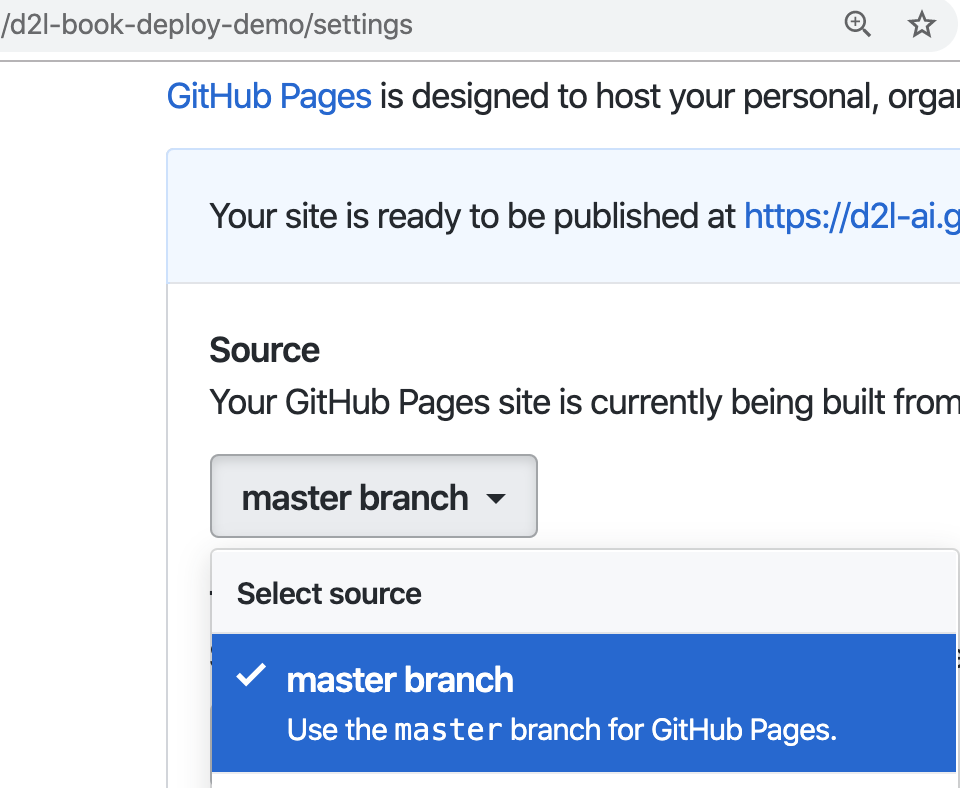
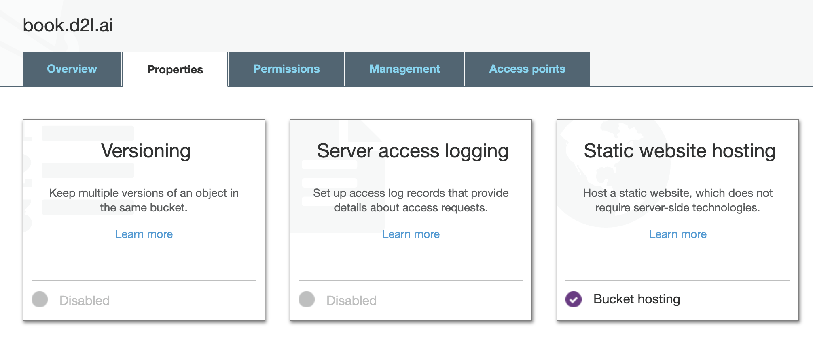

<!--
 * @version:
 * @Author:  StevenJokess https://github.com/StevenJokess
 * @Date: 2020-09-29 19:37:10
 * @LastEditors:  StevenJokess https://github.com/StevenJokess
 * @LastEditTime: 2020-09-29 19:59:17
 * @Description:
 * @TODO::
 * @Reference:https://book.d2l.ai/user/deploy.html
 * https://github.com/d2l-ai/d2l-book/edit/master/docs/user/deploy.md
-->

# 部署

您可以将生成的结果复制到可以在线提供内容的任何您喜欢的位置。 否则，`d2lbook`提供了两种方法来部署构建结果：通过[Github]（http://github.com/）或通过[AWS]（https://aws.amazon.com/）进行部署。

## 用Github部署

[Github Pages](https://pages.github.com/)
允许我们通过Github repo来托管一个网站。为此，我们首先需要创建一个github repo，例如，我们为此例创建了[d2l-ai/ d2l-bookdeploy-demo](https://github.com/d2l-ai/d2l-bookdeploy-demo)。然后在“设置-> GitHub Pages”中从主分支启用服务。您将获得一个URL来访问它。
对于这个例子，见[d2l-ai.github.io/d2l-book-deploy-demo](https://d2l-ai.github.io/d2l-book-deploy-demo/)。 您可以将任何内容添加到`README.md`中，该内容不会显示在网站上。


:width:`400px`

现在，让我们用指定的`[deploy] github_repo`创建一个项目，并构建HTML和PDF。您将看到大量的日志信息，这要感谢LaTeX(更准确地说是`xelatex`)。

```{.python .input}
!mkdir -p deploy
```

```{.python .input}
%%writefile deploy/index.md
# Deploying Demo for d2lbook

This is a demo to deploy on Github.

````toc
get_started
````
```

```{.python .input}
%%writefile deploy/get_started.md
# Getting Started

Please first install my favorite package `numpy`.
```

```{.python .input}
%%writefile deploy/config.ini
[project]
name = deply-demo

[html]
header_links = PDF, https://https://d2l-ai.github.io/d2l-book-deploy-demo/deply-demo.pdf, fas fa-file-pdf

[deploy]
github_repo = d2l-ai/d2l-book-deploy-demo
```

```{.python .input}
!cd deploy; d2lbook build html pdf
```

## 通过AWS部署

另一个受支持的选项是通过AWS进行部署。这个选项提供了更多的灵活性，但是需要您了解AWS的基本用法。

我们推荐以下部署过程:

1.将结果复制到[S3](https://aws.amazon.com/s3/)。
2.通过使用[CloudFront](https://aws.amazon.com/cloudfront/)与[CDN](https://en.wikipedia.org/wiki/Content_delivery_network)一起服务来减少延迟。
3.在[Route 53]购买并添加一个定制域名(https://aws.amazon.com/route53/)

现在让我们一步一步地完成这三个步骤。在开始之前，您需要有一个有效的AWS帐户，并通过运行“AWS configure”输入您的[AWS访问密钥](https://docs.aws.amazon.com/IAM/latest/UserGuide/id_credentials_access-keys.html)。

首先，创建一个S3存储桶。 您可以将目标域名用作存储桶名称。 例如，此站点部署在book.d2l.ai，然后我们创建了一个名为`book.d2l.ai`的存储桶。 此外，在创建此存储桶时，我们需要禁用通过ACL阻止公共访问的权限，请参见fig_s3-acl，并启用静态网站托管，请参见fig_s3-web-hosting。 然后，您将获得一个URL来访问此存储桶。 在我们的示例中，它是http://book.d2l.ai.s3-website-us-west-2.amazonaws.com/。


:label:`fig_s3-acl`
:width:`500px`



:label:`fig_s3-web-hosting`
:width:`500px`

其次，通过指定以下选项来创建新的CloudFront分配
-原始域名：以前的S3 URL，不含`http://`， 例如 `book.d2l.ai.s3-website-us-west-2.amazonaws.com`
-默认根对象：`index.html`
-[可选]备用域名（CNAME）：您的目标域名，例如 `book.d2l.ai`
-[可选] SSL证书：您可以在[证书管理器]（https://aws.amazon.com/certificate-manager/）中创建一个，然后选择它。

几分钟后，我们将获得`d1y0wi2ibwmzrt.cloudfront.net`等域名。

第三，你可以在53号路由上购买一个域名，或者将53号路由的DNS添加到你现有的域名中。在此之后，创建一个“托管区域”，然后创建一个类型- a记录集，其中CoundFront域名作为别名目标，参见:numref: `fig_record-set`作为示例。

:label:`fig_record-set`
:width:`350px`

完成后，在以下`config.ini`条目中指定您的S3存储桶名称。

```bash
[deploy]
s3_bucket = s3://book.d2l.ai
```

每次运行`d2lbook deploy`时，所有结果都将同步到这个bucket并自动部署。注意，由于我们启用了一个CDN，任何新的变化可能需要一段时间才能在您的URL中显示(例如http://book.d2l.ai)。但是您可以检查S3 bucket URL(例如http://book.d2l.ai.s3-website-us-west-2.amazonaws.com)来立即检查更改。
