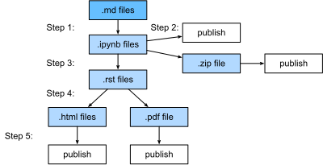

<!--
 * @version:
 * @Author:  StevenJokess https://github.com/StevenJokess
 * @Date: 2020-09-29 21:08:45
 * @LastEditors:  StevenJokess https://github.com/StevenJokess
 * @LastEditTime: 2020-09-29 21:17:02
 * @Description:
 * @TODO::
 * @Reference:https://book.d2l.ai/develop/pipeline.html#multiple-implementations
 * https://github.com/d2l-ai/d2l-book/edit/master/docs/develop/pipeline.md
-->

# 构造流水线

源文件是标记文件。它们要么是纯粹的减记文件，要么是以减记格式保存并删除输出的juypyter笔记本。对于后者，我们可以使用Jupyter直接用`notedown`插件编辑它们，然后在提交之前运行“Kernel -> Restart & Clear Output”。

然后我们的pipeline运行以下步骤来发布制品。

1. 将.md文件转换为.ipynb文件并对每个文件进行评估。我们使用.md文件作为源文件格式的原因是它很容易检查源文件的更改。我们评估每一次，以保证每一个笔记本是可执行的。这个评估步骤可能很耗时，我们可以
   - 假设每个笔记本可以在10分钟内执行，我们可以使用多个gpu来加速执行
   - 如果源.md文件自上次评估以来没有改变，我们可以重用缓存的.ipynb文件以避免再次执行。
   - 我们使用多个进程并行运行笔记本。
2. 带输出的.ipynb文件可以直接上传到Github，这样用户就可以克隆它在本地或云上运行。此外，我们压缩所有文件，以便用户可以轻松下载。
3. 然后将这些.ipynb文件转换为与Sphinx兼容的.rst文件。另外的预处理步骤用于图像/表格/引用文献。
4. 使用Sphinx构建.html和.pdf文件
5. 在线发布所有的.html/.pdf/.zip文件，比如放到AWS S3存储桶中。

## 多种实现

