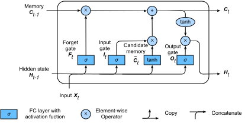

<!--
 * @version:
 * @Author:  StevenJokess https://github.com/StevenJokess
 * @Date: 2020-09-29 20:00:18
 * @LastEditors:  StevenJokess https://github.com/StevenJokess
 * @LastEditTime: 2020-09-29 20:51:19
 * @Description:
 * @TODO::
 * @Reference:https://book.d2l.ai/user/markdown.html#references
 * https://github.com/d2l-ai/d2l-book/edit/master/docs/user/markdown.md
-->

# Markdown 代码块
:label:`sec_markdown`

`d2lbook`提供了Jupyter中常规降价支持之外的其他功能。

## 内容的目录

您可以使用`toc`代码块来指定目录。 在这里`maxdepth：2`表示显示两级文件，而`:numbered:`表示在每个部分增加编号（默认未启用）。 另请注意，您无需指定文件扩展名。


`````
```toc
:maxdepth: 2
:numbered:

guide/index
```
`````

## 图片

我们可以将图像标题放在[]中。此外，我们可以在内联块中使用:width:后跟它的值来指定图像的宽度，类似地，使用:height:表示高度。

```

:width:`400px`
```


:width:`400px`

### SVG图片

我们建议您尽可能多地使用SVG图像。 它锋利，尺寸小。 但是，由于Latex不支持SVG图像，因此，如果要构建PDF输出，则需要安装`rsvg-convert`。 在Macos上，您可以简单地`brew install librsvg`， 或为Ubuntu用sudo apt-get install librsvg2-bin安装librsvg。



### 表

您可以通过使用`:`在表前面插入表标题。注意，您需要在标题和表本身之间留一个空行。

```
: 数字是被 $z_{ij} = \sum_{k}x_{ik}y_{kj}$计算得的。

| Year | Number | Comment |
| ---  | --- | --- |
| 2018 | 100 | Good year |
| 2019 | 200 | Even better, add something to make this column wider |
```

: 数字是被 $z_{ij} = \sum_{k}x_{ik}y_{kj}$计算得的。

| Year | Number | Comment |
| ---  | --- | --- |
| 2018 | 100 | Good year |
| 2019 | 200 | Even better, add something to make this column wider  |

如果表标题号没有正确显示，您可能需要更新`pandoc`到最新版本。

## 交叉引用

我们经常想在书中参考章节、图表、表格和方程式。

### 引用的部分

我们可以在章节标题之后立即放置一个标签，以允许通过其标签引用该章节。在内联代码块中，标签格式为` :label:`后面跟着标签名称。

```
### Referencing Sections
:label:`my_sec3`
```

然后我们可以通过`:ref:`后跟一个内联代码块中的标签名称来引用这一节

```
:ref:`my_sec3` 显示了如何引用一小节。
```

:ref:`my_sec3` 显示了如何引用一小节。

注意，它显示了引用的部分标题和一个可点击的链接。我们还可以通过将:num:更改为:numref:来使用编号版本，例如2.5.4.1节。

如果标签不正确，假设我们将`my_sec2`放在这里，那么构建日志将包含一个警告，例如

```
WARNING: undefined label: my_sec2
```

可以通过在`config.ini`中设置`warning_is_error = True`将其转换为错误。

此外，我们还可以交叉引用其他文件的标签，如:numref:`sec_code`。这也适用于图形、表格和方程式。

### 引用的图片

类似地，我们可以标记图像并在以后引用它。

```

:width:`300px`
:label:`img_catdog`

As can be seen from :numref:`img_catdog`,
```


:width:`300px`
:label:`img_catdog`

As can be seen from :numref:`img_catdog`, there is a cat and a dog.

### 引用方程式

这里的区别是我们需要使用eqlabel而不是label。例如

```
$$\hat{\mathbf{y}}=\mathbf X \mathbf{w}+b$$
:eqlabel:`linear`
在 :eqref:`linear`,我们定义了线性模型。
```

在 :eqref:`linear`,我们定义了线性模型。

### 引用文献

首先把你的bib文件放在某个地方。所有引用都将显示在它插入HTML的地方。但在PDF中，所有引用都将移动到文档的末尾。然后我们可以通过`:cite:`引用一篇论文。多页纸可以用特种纸隔开(注意应该没有空间)

```
The breakthrough of deep learning origins from :cite:`krizhevsky2012imagenet` for...

Two keys together :cite:`he2016deep,devlin2018bert`...

:bibliography:`../refs.bib`
```

深度学习的突破源于:cite:`krizhevsky2012imagenet`
对于计算机视觉，有大量的后续工作，如:cite:`he2016deep`
NLP也在跟进最近的工作，最近的:cite:`devlin2018bert`显示了重要的进展。

两个key一起:cite:`he2016deep,devlin2018bert`。 单作者:cite:`mitchell80`，双作者:cite:`Newell81`。

### References

:bibliography:`../refs.bib`
