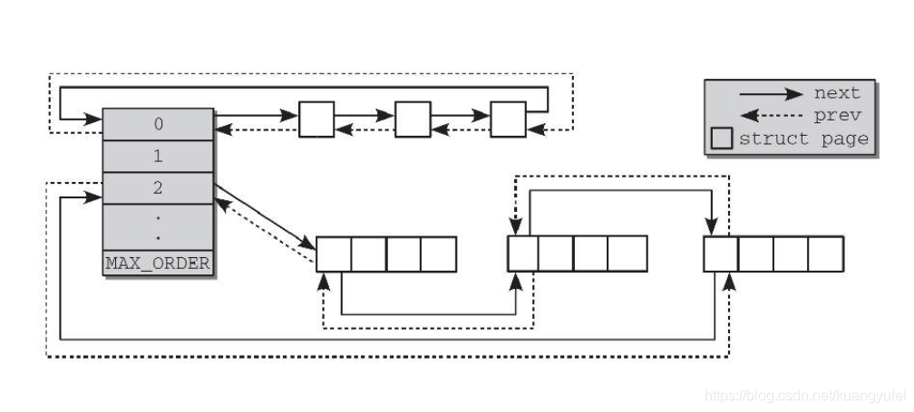

<!--
 * @version:
 * @Author:  StevenJokess https://github.com/StevenJokess
 * @Date: 2020-12-20 20:45:44
 * @LastEditors:  StevenJokess https://github.com/StevenJokess
 * @LastEditTime: 2020-12-20 21:21:10
 * @Description:
 * @TODO::
 * @Reference:https://blog.csdn.net/kuangyufei/article/details/108989906
-->

## 鸿蒙内核有多少代码

内存部分占了整个kernel代码量近30%，代码多实现复杂，而且内存部分还分了两个文件夹mem,vm大书特书，为什么要分两个文件夹？应该是鸿蒙内核开发者想从目录的名称上区分内存的层级概念，vm是内存模块的更底层实现，mem是提供给上层使用对vm层的调用。

## mem层

mem层介绍可以参考 [LiteOS > 开发指南> 内核开发指南> 内存> 概述](https://support.huaweicloud.com/kernelmanual-LiteOS/zh-cn_topic_0145350130.html) 看，有更详细的描述，这里结合代码说。

Huawei LiteOS的内存管理分为静态内存管理和动态内存管理，提供内存初始化、分配、释放等功能。

动态内存：在动态内存池中分配用户指定大小的内存块。

优点：按需分配。
缺点：内存池中可能出现碎片。

静态内存：在静态内存池中分配用户初始化时预设（固定）大小的内存块。

优点：分配和释放效率高，静态内存池中无碎片。
缺点：只能申请到初始化预设大小的内存块，不能按需申请。

动态内存管理，即在内存资源充足的情况下，从系统配置的一块比较大的连续内存（内存池），根据用户需求，分配任意大小的内存块。当用户不需要该内存块时，又可以释放回系统供下一次使用。与静态内存相比，动态内存管理的好处是按需分配，缺点是内存池中容易出现碎片。LiteOS动态内存支持DLINK和BEST LITTLE两种标准算法。

动态内存管理模块为用户提供下面几种功能。TODO:见URL

## OsMemAllocWithCheck

采用内存池是嵌入式内存管理的一种常用做法，目的是减少申请和释放内存的开销，简单说就是先申请一大块内存，需要时从空闲链表中split，怎么切割鸿蒙就看最佳适应算法(best fit)，用完了回收，node进入空闲链表，并从小到大排序，如果相邻两块都是可用内存块就合并。直接看LOS_MemAlloc内主要函数OsMemAllocWithCheck代码

https://github.com/kuangyufei/kernel_liteos_a_note/blob/2912d9b4e69ec480fed06ee626c689ad3477868b/kernel/base/mem/bestfit/los_memory.c#L1640-L1687

```c
STATIC INLINE VOID *OsMemAllocWithCheck(VOID *pool, UINT32 size, UINT32 intSave)
{
    LosMemDynNode *allocNode = NULL;
    UINT32 allocSize;
    LosMemPoolInfo *poolInfo = (LosMemPoolInfo *)pool;
    const VOID *firstNode = (const VOID *)((UINT8 *)OS_MEM_HEAD_ADDR(pool) + OS_DLNK_HEAD_SIZE);
    INT32 ret;

    if (OsMemAllocCheck(pool, intSave) == LOS_NOK) {
        return NULL;
    }

    allocSize = OS_MEM_ALIGN(size + OS_MEM_NODE_HEAD_SIZE, OS_MEM_ALIGN_SIZE);
    if (allocSize == 0) {
        return NULL;
    }
retry:

    allocNode = OsMemFindSuitableFreeBlock(pool, allocSize);//从内存池中找到合适的内存块
    if (allocNode == NULL) {
        if (poolInfo->flag & MEM_POOL_EXPAND_ENABLE) {
            ret = OsMemPoolExpand(pool, allocSize, intSave);//木有找到就扩展内存池
            if (ret == 0) {
                goto retry;
            }
        }
        PRINT_ERR("---------------------------------------------------"
                  "--------------------------------------------------------\n");
        MEM_UNLOCK(intSave);
        OsMemInfoPrint(pool);
        MEM_LOCK(intSave);
        PRINT_ERR("[%s] No suitable free block, require free node size: 0x%x\n", __FUNCTION__, allocSize);
        PRINT_ERR("----------------------------------------------------"
                  "-------------------------------------------------------\n");
        return NULL;
    }
    if ((allocSize + OS_MEM_NODE_HEAD_SIZE + OS_MEM_ALIGN_SIZE) <= allocNode->selfNode.sizeAndFlag) {
        OsMemSplitNode(pool, allocNode, allocSize);//找到了就劈开node
    }
    OsMemListDelete(&allocNode->selfNode.freeNodeInfo, firstNode);//从空闲双链表中删除该节点
    OsMemSetMagicNumAndTaskID(allocNode);
    OS_MEM_NODE_SET_USED_FLAG(allocNode->selfNode.sizeAndFlag);
    if ((pool == (VOID *)OS_SYS_MEM_ADDR) || (pool == (VOID *)m_aucSysMem0)) {
        OS_MEM_ADD_USED(OS_MEM_NODE_GET_SIZE(allocNode->selfNode.sizeAndFlag), OS_MEM_TASKID_GET(allocNode));
    }
    OsMemNodeDebugOperate(pool, allocNode, size);
    return (allocNode + 1);
}
```

TODO:很显然，最佳适应算法(best fit)去带来很多极小块内存碎片的问题。

## vm层

vm目录：是虚拟内存的代码实现，包括物理内存的段页式管理，内存虚拟地址<->物理地址映射，缺页中断处理，分配大块内存的伙伴算法，LRU置换算法，以及针对用户态开发，提供的一套内存系统调用接口等等，这部分官方没有提供任何文档，代码注释也很少，全靠硬摸。

## 先说三种虚拟空间

空间(space)这个概念很重要，还记得进程描述符(LosProcessCB)里的LosVmSpace  *vmSpace吗？它是进程使用内存的方式，空间就是边界，进程只能在划定的空间里运行，任何指令都不能越界运行。

在鸿蒙内核源码分析(内存分配篇)中已讲明虚拟内存是MMU带出来的概念，为解决物理内存满足不了多进程对内存的需要。虚拟内存可以远大于物理内存。虚拟空间是进程层面的概念，每个进程都有一个，给进程独享整个物理内存的假象。对鸿蒙来说操作系统和驱动程序运行在内核空间(kernel space)，应用程序运行在用户空间(user space), 在运行期间需动态分配的向堆空间(heap space)申请内存。具体看代码会更清晰些。

https://github.com/kuangyufei/kernel_liteos_a_note/blob/62d5a09843ddec5ea0e43e72232981b655978eef/kernel/base/vm/los_vm_map.c#L153-L165

```c
//内核虚拟空间初始化
BOOL OsKernVmSpaceInit(LosVmSpace *vmSpace, VADDR_T *virtTtb)//内核空间页表是编译时放在bbs段指定的,共用 L1表
{
    vmSpace->base = KERNEL_ASPACE_BASE;//内核虚拟空间基地址
    vmSpace->size = KERNEL_ASPACE_SIZE;//内核虚拟空间大小
    vmSpace->mapBase = KERNEL_VMM_BASE;//内核虚拟空间映射基地址
    vmSpace->mapSize = KERNEL_VMM_SIZE;//内核虚拟空间映射大小
#ifdef LOSCFG_DRIVERS_TZDRIVER
    vmSpace->codeStart = 0;
    vmSpace->codeEnd = 0;
#endif
    return OsVmSpaceInitCommon(vmSpace, virtTtb);//virtTtb 用于初始化 mmu
}
```

https://github.com/kuangyufei/kernel_liteos_a_note/blob/62d5a09843ddec5ea0e43e72232981b655978eef/kernel/base/vm/los_vm_map.c#L166-178

动态分配

```c
//内核虚拟分配空间初始化
BOOL OsVMallocSpaceInit(LosVmSpace *vmSpace, VADDR_T *virtTtb)//内核动态空间的页表是动态申请得来，共用 L1表
{
    vmSpace->base = VMALLOC_START;//内核虚拟分配空间基地址
    vmSpace->size = VMALLOC_SIZE;//内核虚拟分配空间大小
    vmSpace->mapBase = VMALLOC_START;//内核虚拟分配空间映射基地址
    vmSpace->mapSize = VMALLOC_SIZE;//内核虚拟分配空间映射区大小
#ifdef LOSCFG_DRIVERS_TZDRIVER
    vmSpace->codeStart = 0;
    vmSpace->codeEnd = 0;
#endif
    return OsVmSpaceInitCommon(vmSpace, virtTtb);
}
```

https://github.com/kuangyufei/kernel_liteos_a_note/blob/62d5a09843ddec5ea0e43e72232981b655978eef/kernel/base/vm/los_vm_map.c#L179-194

```c
//用户虚拟空间初始化
BOOL OsUserVmSpaceInit(LosVmSpace *vmSpace, VADDR_T *virtTtb)//用户空间的页表是动态申请得来,每个进程有属于自己的L1,L2表
{
    vmSpace->base = USER_ASPACE_BASE;//用户空间基地址
    vmSpace->size = USER_ASPACE_SIZE;//用户空间大小
    vmSpace->mapBase = USER_MAP_BASE;//用户空间映射基地址
    vmSpace->mapSize = USER_MAP_SIZE;//用户空间映射大小
    vmSpace->heapBase = USER_HEAP_BASE;//用户堆区开始地址
    vmSpace->heapNow = USER_HEAP_BASE;//用户堆区当前地址默认 == 开始地址
    vmSpace->heap = NULL;
#ifdef LOSCFG_DRIVERS_TZDRIVER
    vmSpace->codeStart = 0;
    vmSpace->codeEnd = 0;
#endif
    return OsVmSpaceInitCommon(vmSpace, virtTtb);
}
```

它们唯一的区别是虚拟地址的开始位置和大小不一样，但是所有用户进程的虚拟地址都是一样的，注意用户进程是一样的，细品。

一样的:

```c
#ifdef LOSCFG_DRIVERS_TZDRIVER
    vmSpace->codeStart = 0;
    vmSpace->codeEnd = 0;
#endif
    return OsVmSpaceInitCommon(vmSpace, virtTtb);
```

---

https://github.com/kuangyufei/kernel_liteos_a_note/blob/62d5a09843ddec5ea0e43e72232981b655978eef/kernel/base/vm/los_vm_map.c#L128-L144

```c
STATIC BOOL OsVmSpaceInitCommon(LosVmSpace *vmSpace, VADDR_T *virtTtb)
{
    LOS_RbInitTree(&vmSpace->regionRbTree, OsRegionRbCmpKeyFn, OsRegionRbFreeFn, OsRegionRbGetKeyFn);//初始化虚拟存储空间-以红黑树组织方式

    LOS_ListInit(&vmSpace->regions);//初始化虚拟存储区域-以双循环链表组织方式
    status_t retval = LOS_MuxInit(&vmSpace->regionMux, NULL);//初始化互斥量
    if (retval != LOS_OK) {
        VM_ERR("Create mutex for vm space failed, status: %d", retval);
        return FALSE;
    }

    (VOID)LOS_MuxAcquire(&g_vmSpaceListMux);
    LOS_ListAdd(&g_vmSpaceList, &vmSpace->node);//加入到虚拟空间双循环链表
    (VOID)LOS_MuxRelease(&g_vmSpaceListMux);

    return OsArchMmuInit(&vmSpace->archMmu, virtTtb);//对空间mmu初始化
}
```

https://github.com/kuangyufei/kernel_liteos_a_note/blob/62d5a09843ddec5ea0e43e72232981b655978eef/kernel/base/vm/los_vm_map.c#L58-L70

```c
//通过虚拟地址获取所属空间地址
LosVmSpace *LOS_SpaceGet(VADDR_T vaddr)
{
    if (LOS_IsKernelAddress(vaddr)) {	//是否为内核空间
        return LOS_GetKVmSpace();		//获取内核空间
    } else if (LOS_IsUserAddress(vaddr)) {//是否为用户空间
        return OsCurrProcessGet()->vmSpace;//当前进程的虚拟空间
    } else if (LOS_IsVmallocAddress(vaddr)) {//是否为内核分配空间
        return LOS_GetVmallocSpace();//获取内核分配空间
    } else {
        return NULL;
    }
}
```


这些空间都挂在 g_vmSpaceList 双循环链表上，LOS_SpaceGet可以通过虚拟地址反查是属于哪种空间。每一个空间都有一张页表和物理内存页表形成映射关系，虚拟内存和物理内存都是页对页的映射，两边每页都是4K，也必须是一样的！否则无法完成映射。具体如何映射的将在鸿蒙内核源码分析(内存映射篇)中说明，在调度算法切换进程时就需要切换至该进程自己的虚拟空间，即MMU上下文。

## 物理内存初始化

物理内存部分见代码: los_vm_phys.c，到了物理内存就没有什么进程，空间的概念了，只有页的概念！一页4K

物理内存的管理和分配都是围绕着页展开的，鸿蒙对物理内存使用了段页式管理，看代码吧，关键处都加了注释。

https://github.com/kuangyufei/kernel_liteos_a_note/blob/542126e008f170931070b9549bbfef5a66731877/kernel/base/vm/los_vm_phys.c#L47-L53

```c
/* Physical memory area array */
STATIC struct VmPhysArea g_physArea[] = {//这里只整了一个区域,即只生成一个段,鸿蒙物理内存采用段页式管理
    {
        .start = SYS_MEM_BASE, //整个物理内存基地址
        .size = SYS_MEM_SIZE_DEFAULT,//整个物理内存总大小
    },
};
```

https://github.com/kuangyufei/kernel_liteos_a_note/blob/c7eee5a9ca11f214b5601c501d9510bc8e16e802/kernel/base/vm/los_vm_page.c#L61-L90

```c
VOID OsVmPageStartup(VOID)
{
    struct VmPhysSeg *seg = NULL;
    LosVmPage *page = NULL;
    paddr_t pa;
    UINT32 nPage;
    INT32 segID;

    OsVmPhysAreaSizeAdjust(ROUNDUP((g_vmBootMemBase - KERNEL_ASPACE_BASE), PAGE_SIZE));//校正 g_physArea size

    nPage = OsVmPhysPageNumGet();//得到 g_physArea 总页数
    g_vmPageArraySize = nPage * sizeof(LosVmPage);//页表总大小
    g_vmPageArray = (LosVmPage *)OsVmBootMemAlloc(g_vmPageArraySize);//申请页表存放区域

    OsVmPhysAreaSizeAdjust(ROUNDUP(g_vmPageArraySize, PAGE_SIZE));// g_physArea 变小

    OsVmPhysSegAdd();// 段页绑定
    OsVmPhysInit();// 加入空闲链表和设置置换算法,LRU(最近最久未使用)算法

    for (segID = 0; segID < g_vmPhysSegNum; segID++) {
        seg = &g_vmPhysSeg[segID];
        nPage = seg->size >> PAGE_SHIFT;
        for (page = seg->pageBase, pa = seg->start; page <= seg->pageBase + nPage;
             page++, pa += PAGE_SIZE) {
            OsVmPageInit(page, pa, segID);//page初始化
        }
        OsVmPageOrderListInit(seg->pageBase, nPage);// 页面分配的排序
    }
}
```

https://github.com/kuangyufei/kernel_liteos_a_note/blob/542126e008f170931070b9549bbfef5a66731877/kernel/base/vm/los_vm_phys.c#L119-L129

```c
UINT32 OsVmPhysPageNumGet(VOID)
{
    UINT32 nPages = 0;
    INT32 i;

    for (i = 0; i < (sizeof(g_physArea) / sizeof(g_physArea[0])); i++) {
        nPages += g_physArea[i].size >> PAGE_SHIFT;//右移12位，相当于除以4K,得出总页数
    }

    return nPages;
}
```

https://github.com/kuangyufei/kernel_liteos_a_note/blob/542126e008f170931070b9549bbfef5a66731877/kernel/base/vm/los_vm_phys.c#L95-L107

```c
VOID OsVmPhysSegAdd(VOID)
{
    INT32 i, ret;

    LOS_ASSERT(g_vmPhysSegNum <= VM_PHYS_SEG_MAX);

    for (i = 0; i < (sizeof(g_physArea) / sizeof(g_physArea[0])); i++) {//将g_physArea转化成段
        ret = OsVmPhysSegCreate(g_physArea[i].start, g_physArea[i].size);//一个区对应一个段
        if (ret != 0) {
            VM_ERR("create phys seg failed");
        }
    }
}
```

https://github.com/kuangyufei/kernel_liteos_a_note/blob/c7eee5a9ca11f214b5601c501d9510bc8e16e802/kernel/base/vm/los_vm_page.c#L46-L55

```c
//虚拟页初始化
STATIC VOID OsVmPageInit(LosVmPage *page, paddr_t pa, UINT8 segID)
{
    LOS_ListInit(&page->node);			//页节点初始化
    page->flags = FILE_PAGE_FREE;		//映射文件初始标识
    LOS_AtomicSet(&page->refCounts, 0);	//引用次数0
    page->physAddr = pa;				//物理地址
    page->segID = segID;				//物理地址使用段管理，段ID
    page->order = VM_LIST_ORDER_MAX;	//所属伙伴算法块组
}
```


 代码中可以看出初始化对物理内存做了几个动作：

1.对整个物理内存进行了分页，每页框4K，存放在大页表数组中 g_vmPageArray

2.段页绑定，根据g_physArea数组的大小来创建段，因数组里只有一条数据，所以只有一个段

3.初始化了回收双链表和置换算法，采用了LRU置换算法。

4.对每一页框进行了初始化，每个页框可用于分配，指定了物理地址，注意这是物理内存的页。

5.对伙伴算法初始化。

## 什么是伙伴算法？

简单的说就是把所有的空闲页面分为10个块组，每组中块的大小是2的幂次方个页面，例如，第0组中块的大小都为2的0次方 （1个页面），第1组中块的大小为都为2的1次方（2个页面），第9组中块的大小都为2的9次方（512个页面）。也就是说，每一组中块的大小是相同的，且这同样大小的块形成一个链表，能看懂下面这张图的就看懂了伙伴算法，一个方块代表一个物理页框。怎么被分配的？



物理内存是以页为单位被分配的，详细看 LOS_PhysPagesAllocContiguous，看下哪些地方调用了它。

1.初始化进程块会用到  2.扩展内存池会用到，3，用户进程空间初始化会用到 4，内核动态分配的时候会到，这个上面已经讲过了。5.动态加载可执行程序会用到，

LOS_PhysPagesAllocContiguous 调用的主要函数是：

