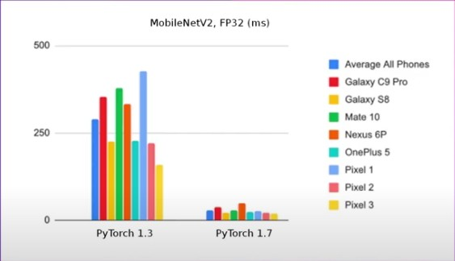

<!--
 * @version:
 * @Author:  StevenJokess https://github.com/StevenJokess
 * @Date: 2020-11-28 00:49:25
 * @LastEditors:  StevenJokess https://github.com/StevenJokess
 * @LastEditTime: 2020-11-28 17:21:54
 * @Description:
 * @TODO::
 * @Reference:
-->
If Android SDK and Android NDK are already installed you can install this application to the connected android device or emulator with:

./gradlew installDebug

https://www.youtube.com/watch?v=r8KoiC6OmAI

cpu performance

---

from torch.utils.mobile_optimzer import optimize_for_mobile

opt_model = optimize_for_mobile(my_model)
opt_model.save(out_path)

c10::CPUCachingAllocator allocator;
torch::jit::module model = torch::jit::load(...);

...

for (....){
    c10::WithCPUCachingAllocatorGuard guard($allocator);
    auto outputs = model.forward(inputs);
    ...
}

---

two apis
apple : metal
android : vulkan

model_metal = optimize_for_mobile(model, 'backend=metal')

model_vulkan = optimize_for_mobile(model, 'backend=vulkan')

---

Metal
Speed up 33% from Metal vs CPU with XNNPACK ResNet18 on iPhone 11

torch::Tensor input_cpu = ...;
auto input_gpu = input_cpu.metal();
auto output = model.forward({input_gpu}.toTensor().cpu());

Vulkan

Module module = Module.load(..., Device.VULKAN);

---

- operator fusion
- Quantization
- Memory format
- Memory re-use
- Benchmark setup

---

external dependency

pytorch.org-mobile
pytorch.org-Tutorials-mobile
pytorch.org-Tutorials-Recipes-mobile
