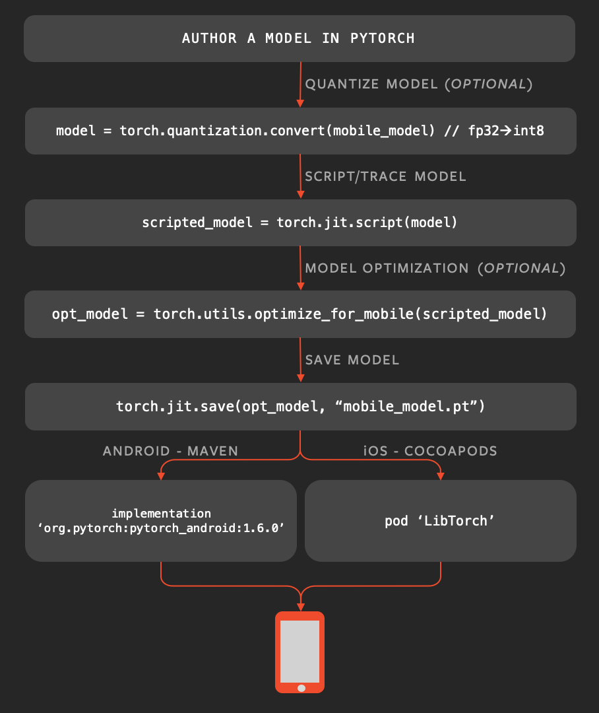

<!--
 * @version:
 * @Author:  StevenJokess https://github.com/StevenJokess
 * @Date: 2020-11-13 17:23:45
 * @LastEditors:  StevenJokess https://github.com/StevenJokess
 * @LastEditTime: 2020-11-13 21:09:46
 * @Description:
 * @TODO::
 * @Reference:
-->

https://pytorch.org/mobile/home/

越来越需要在边缘设备上执行ML模型以减少延迟，保护隐私并启用新的交互式用例。 过去，工程师曾经分别训练模型。 然后，他们将经历一个多步骤，容易出错且通常很复杂的过程，以转换模型以在移动设备上执行。 移动运行时通常与培训期间可用的操作显着不同，从而导致开发人员不一致，最终导致用户体验不一致。

PyTorch Mobile通过完全保留在PyTorch生态系统中，允许从培训到部署的无缝过程来消除这些摩擦表面。 它提供了端到端的工作流程，简化了对移动设备生产环境的研究。 此外，它还通过联合学习技术为隐私保护功能铺平了道路。

PyTorch Mobile目前处于beta阶段，正在大规模生产中使用。 一旦API被锁定，它将很快以稳定版本的形式提供。
Key features of PyTorch Mobile:

Available for iOS, Android and Linux
Provides APIs that cover common preprocessing and integration tasks needed for incorporating ML in mobile applications
Support for tracing and scripting via TorchScript IR
Support for XNNPACK floating point kernel libraries for Arm CPUs
Integration of QNNPACK for 8-bit quantized kernels. Includes support for per-channel quantization, dynamic quantization and more
Build level optimization and selective compilation depending on the operators needed for user applications, i.e., the final binary size of the app is determined by the actual operators the app needs
Support for hardware backends like GPU, DSP, NPU will be available soon


https://github.com/pytorch/pytorch/tree/master/android

https://github.com/pytorch/pytorch/blob/master/android/pytorch_android_torchvision/src/androidTest/java/org/pytorch/torchvision/TorchVisionInstrumentedTests.java

```java
package org.pytorch.torchvision;

import static org.junit.Assert.assertArrayEquals;

import android.graphics.Bitmap;
import androidx.test.ext.junit.runners.AndroidJUnit4;
import org.junit.Test;
import org.junit.runner.RunWith;
import org.pytorch.Tensor;

@RunWith(AndroidJUnit4.class)
public class TorchVisionInstrumentedTests {

  @Test
  public void smokeTest() {
    Bitmap bitmap = Bitmap.createBitmap(320, 240, Bitmap.Config.ARGB_8888);
    Tensor tensor =
        TensorImageUtils.bitmapToFloat32Tensor(
            bitmap,
            TensorImageUtils.TORCHVISION_NORM_MEAN_RGB,
            TensorImageUtils.TORCHVISION_NORM_STD_RGB);
    assertArrayEquals(new long[] {1l, 3l, 240l, 320l}, tensor.shape());
  }
}
```


```cmake
cmake_minimum_required(VERSION 3.4.1)
project(pytorch_vision_jni CXX)
set(CMAKE_CXX_STANDARD 14)
set(CMAKE_VERBOSE_MAKEFILE ON)

set(pytorch_vision_cpp_DIR ${CMAKE_CURRENT_LIST_DIR}/src/main/cpp)

file(GLOB pytorch_vision_SOURCES
  ${pytorch_vision_cpp_DIR}/pytorch_vision_jni.cpp
)

add_library(pytorch_vision_jni SHARED
    ${pytorch_vision_SOURCES}
)

target_compile_options(pytorch_vision_jni PRIVATE
  -fexceptions
)

set(BUILD_SUBDIR ${ANDROID_ABI})

target_link_libraries(pytorch_vision_jni)
```


https://oss.sonatype.org/#nexus-search;quick~pytorch_android

---

https://pytorch.org/tutorials/recipes/mobile_perf.html

介绍

性能(又名延迟)对移动设备上ML模型推断的大多数(如果不是全部的话)应用程序和用例都至关重要。

今天，PyTorch在CPU后端执行模型，等待其他硬件后端可用，如GPU、DSP和NPU。

在这个食谱中，你将学到:

如何优化您的模型，以帮助减少执行时间(更高的性能，更低的延迟)在移动设备上。

如何进行基准测试(以检查优化是否有助于您的用例)。


Benchmarking
The best way to benchmark (to check if optimizations helped your use case) - is to measure your particular use case that you want to optimize, as performance behavior can vary in different environments.

PyTorch distribution provides a way to benchmark naked binary that runs the model forward, this approach can give more stable measurements rather than testing inside the application.

Once you have your android device connected, push speedbenchark_torch binary and your model to the phone:

```
adb push <speedbenchmark-torch> /data/local/tmp
adb push <path-to-scripted-model> /data/local/tmp
benchmark your model:
```

```
adb shell "/data/local/tmp/speed_benchmark_torch --model=/data/local/tmp/model.pt" --input_dims="1,3,224,224" --input_type="float"
```

---


PYTORCH DEMO APPLICATION

We have also created another more complex PyTorch Android demo application that does image classification from camera output and text classification in the same github repo.

To get device camera output it uses Android CameraX API. All the logic that works with CameraX is separated to org.pytorch.demo.vision.AbstractCameraXActivity class.

```
void setupCameraX() {
    final PreviewConfig previewConfig = new PreviewConfig.Builder().build();
    final Preview preview = new Preview(previewConfig);
    preview.setOnPreviewOutputUpdateListener(output -> mTextureView.setSurfaceTexture(output.getSurfaceTexture()));

    final ImageAnalysisConfig imageAnalysisConfig =
        new ImageAnalysisConfig.Builder()
            .setTargetResolution(new Size(224, 224))
            .setCallbackHandler(mBackgroundHandler)
            .setImageReaderMode(ImageAnalysis.ImageReaderMode.ACQUIRE_LATEST_IMAGE)
            .build();
    final ImageAnalysis imageAnalysis = new ImageAnalysis(imageAnalysisConfig);
    imageAnalysis.setAnalyzer(
        (image, rotationDegrees) -> {
          analyzeImage(image, rotationDegrees);
        });

    CameraX.bindToLifecycle(this, preview, imageAnalysis);
  }

  void analyzeImage(android.media.Image, int rotationDegrees)
```

Where the analyzeImage method process the camera output, android.media.Image.

It uses the aforementioned TensorImageUtils.imageYUV420CenterCropToFloat32Tensor method to convert android.media.Image in YUV420 format to input tensor.

After getting predicted scores from the model it finds top K classes with the highest scores and shows on the UI.

