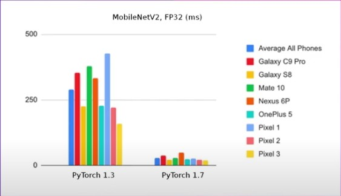

<!--
 * @version:
 * @Author:  StevenJokess https://github.com/StevenJokess
 * @Date: 2020-11-28 00:49:25
 * @LastEditors:  StevenJokess https://github.com/StevenJokess
 * @LastEditTime: 2020-12-06 17:10:15
 * @Description:
 * @TODO::
 * @Reference:
-->

https://www.oreilly.com/library/view/hands-on-machine-learning/9781789955330/5d5633c2-eb7c-40d0-b5a9-f8ba5b2d6004.xhtml

The mobile version of the PyTorch framework
There is no available binary distribution of PyTorch for mobile devices, so we need to build it from source code. We can do this in the same way as we compile its regular version but with additional CMake parameters to enable mobile mode. You also have to install the Android Native Development Kit (NDK), which includes an appropriate version of the C/C++ compiler and the Android native libraries that are required to build the application. The following code snippet shows how to use the command-line environment to check out PyTorch and build its Android mobile version:

cd /home/[USER]git clone https://github.com/pytorch/pytorch.gitcd pytorch/git checkout v1.2.0git submodule update --initexport ANDROID_NDK=/home/[USER]/Android/Sdk/ndk/20.0.5594570 ...

---

If Android SDK and Android NDK are already installed you can install this application to the connected android device or emulator with:

./gradlew installDebug

https://www.youtube.com/watch?v=r8KoiC6OmAI

cpu performance

---

from torch.utils.mobile_optimzer import optimize_for_mobile

opt_model = optimize_for_mobile(my_model)
opt_model.save(out_path)

c10::CPUCachingAllocator allocator;
torch::jit::module model = torch::jit::load(...);

...

for (....){
    c10::WithCPUCachingAllocatorGuard guard($allocator);
    auto outputs = model.forward(inputs);
    ...
}

---

two apis
apple : metal
android : vulkan

model_metal = optimize_for_mobile(model, 'backend=metal')

model_vulkan = optimize_for_mobile(model, 'backend=vulkan')

---

Metal
Speed up 33% from Metal vs CPU with XNNPACK ResNet18 on iPhone 11

torch::Tensor input_cpu = ...;
auto input_gpu = input_cpu.metal();
auto output = model.forward({input_gpu}.toTensor().cpu());

Vulkan

Module module = Module.load(..., Device.VULKAN);

---

- operator fusion
- Quantization
- Memory format
- Memory re-use
- Benchmark setup

---

external dependency

pytorch.org-mobile
pytorch.org-Tutorials-mobile
pytorch.org-Tutorials-Recipes-mobile
